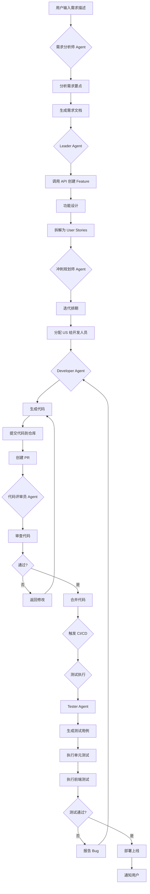
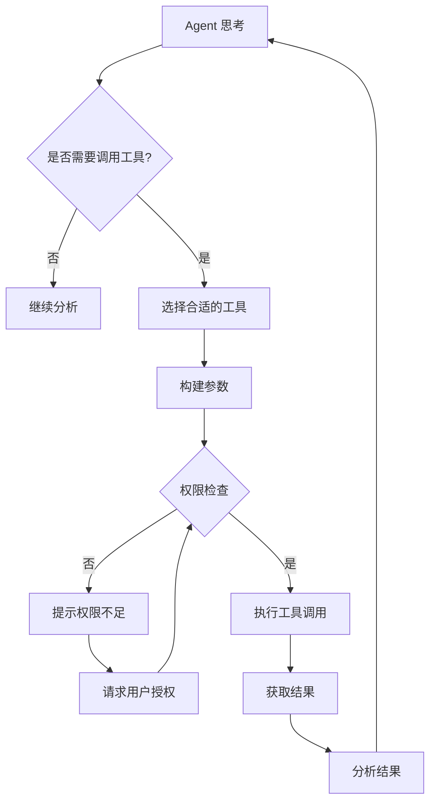
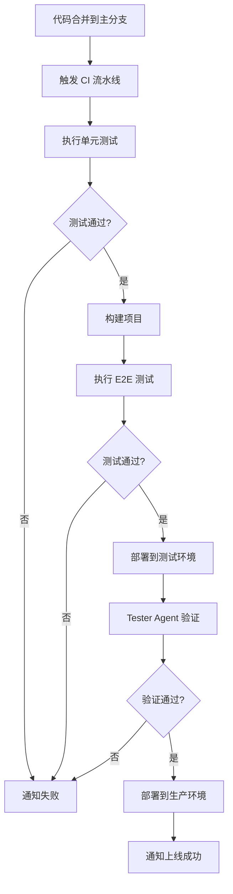
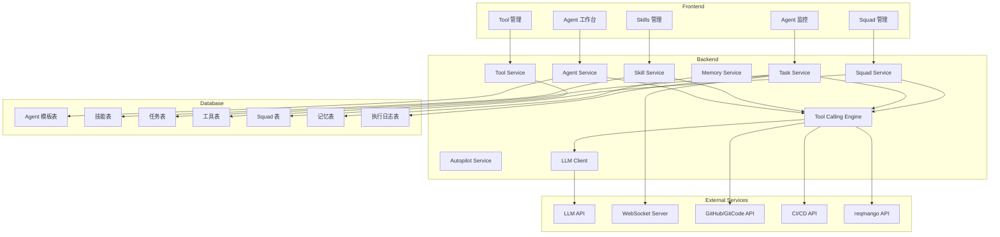
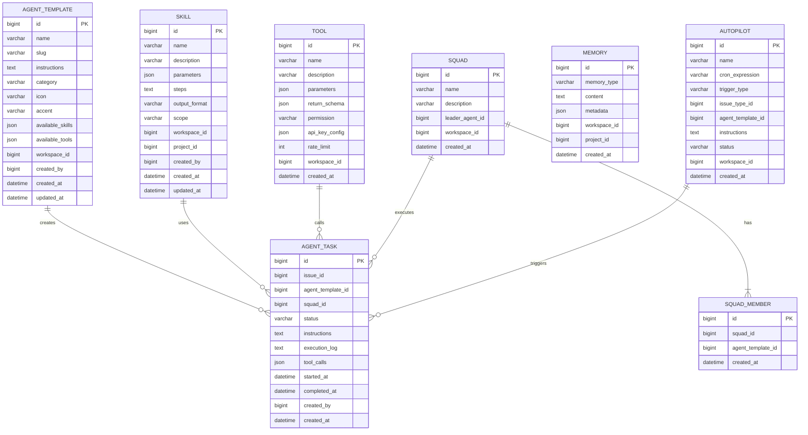

# ReqMango AI Agent 智能协作平台 - 需求规格说明书

> **版本**: v1.0  
> **日期**: 2026-07-24  
> **作者**: AI Agent  
> **状态**: 待审核

---

## 1. 产品概述

### 1.1 项目背景

**当前问题**：AI 能力仅限于被动问答和辅助生成，未能真正融入软件开发全流程。

**解决方案**：借鉴 Multica 的"Agent as Teammates"理念，将 AI Agent 打造为团队的虚拟成员，实现从需求分析到上线的完整软件开发生命周期（SDLC）自动化。

### 1.2 核心目标

| 目标 | 描述 |
|------|------|
| 自动化 | AI 自动执行需求分析、设计、开发、测试、上线全流程 |
| 协作化 | 多 Agent 协同工作，模拟真实团队协作 |
| 智能化 | Agent 具备工具调用、记忆、决策能力 |
| 透明化 | 实时监控 Agent 执行过程，确保可控 |

### 1.3 适用场景

- **敏捷开发团队**：自动化完成需求拆解、排期、开发、测试
- **小型项目**：单人或小团队快速交付产品
- **原型验证**：快速验证产品想法，生成 MVP

---

## 2. 核心功能模块

### 2.1 用户角色

| 角色 | 注册方式 | 核心权限 |
|------|----------|----------|
| 普通用户 | 邮箱注册 | 使用 AI 辅助功能 |
| 项目管理员 | 管理员授权 | 管理 Agent 配置、技能库、工具权限 |
| AI Agent | 系统创建 | 执行分配的任务、调用工具、报告进度 |

### 2.2 功能模块总览

```
┌─────────────────────────────────────────────────────────┐
│              AI Agent 智能协作平台                       │
├─────────────────────────────────────────────────────────┤
│  核心模块                                                │
│  ├── Agent 角色模板系统       # 预定义专业角色            │
│  ├── Agent 模型配置           # 多提供商支持、运行时配置    │
│  ├── Runtime 运行时管理       # 本地 daemon、云端运行时    │
│  ├── Skills 技能系统          # 可复用的 AI 操作指南       │
│  ├── Agent 任务执行           # 工作项分配给 AI            │
│  ├── Agent 监控面板           # 实时执行监控               │
│  ├── Tool Calling 引擎        # 外部工具调用               │
│  ├── Squads 多 Agent 协作     # 团队协作模式               │
│  ├── Memory 记忆系统          # 跨会话上下文管理           │
│  └── 聊天与消息功能           # 工作项聊天、通知            │
├─────────────────────────────────────────────────────────┤
│  扩展模块                                                │
│  ├── Autopilot 定时任务       # Cron/Webhook 触发         │
│  ├── CI/CD 集成              # 构建部署自动化             │
│  └── Agent 绩效分析           # 执行效率统计               │
└─────────────────────────────────────────────────────────┘
```

### 2.3 页面清单

| 页面名称 | 核心模块 | 功能描述 |
|----------|----------|----------|
| Agent 工作台 | Agent 角色选择、任务分配 | 查看可用 Agent、分配工作项、触发 SDLC 流程 |
| Skills 管理 | 技能创建/编辑/共享 | 管理可复用技能库 |
| Agent 监控 | 执行状态、日志查看 | 实时监控 Agent 执行、查看思考过程 |
| Autopilot 配置 | 定时任务配置 | 创建和管理自动任务 |
| 工作项详情 | AI 执行面板 | 在工作项中查看 AI 执行状态、工具调用记录 |
| Tool 管理 | 工具注册/配置/权限 | 管理可用工具列表、配置 API 密钥 |
| Squad 管理 | 团队创建/成员配置 | 创建多 Agent 协作团队 |

---

## 3. 完整 SDLC 流程设计

### 3.1 流程概览



### 3.2 各阶段详细设计

#### 阶段 1：需求分析

| 项目 | 描述 |
|------|------|
| **执行 Agent** | 需求分析师 Agent |
| **输入** | 用户自然语言描述的需求 |
| **处理流程** | 提取需求要点 → 识别功能范围 → 分析技术可行性 → 生成需求分析报告 |
| **输出** | 需求分析报告（包含功能列表、优先级、技术评估） |
| **工具调用** | 无 |

#### 阶段 2：需求设计

| 项目 | 描述 |
|------|------|
| **执行 Agent** | 文档撰写者 Agent |
| **输入** | 需求分析报告 |
| **处理流程** | 撰写 PRD → 设计交互流程 → 定义数据模型 → 输出技术方案 |
| **输出** | PRD 文档、技术方案文档 |
| **工具调用** | 无 |

#### 阶段 3：分派 Feature

| 项目 | 描述 |
|------|------|
| **执行 Agent** | Leader Agent |
| **输入** | 需求设计文档 |
| **处理流程** | 调用项目管理 API → 创建 Feature 工作项 → 设置优先级和负责人 |
| **输出** | Feature 工作项创建成功 |
| **工具调用** | `create_issue`（reqmango API） |

#### 阶段 4：功能设计

| 项目 | 描述 |
|------|------|
| **执行 Agent** | 需求分析师 Agent |
| **输入** | Feature 工作项 |
| **处理流程** | 设计功能模块 → 定义接口规范 → 设计数据库结构 → 输出功能设计文档 |
| **输出** | 功能设计文档（包含接口定义、数据库设计） |
| **工具调用** | 无 |

#### 阶段 5：拆解 US

| 项目 | 描述 |
|------|------|
| **执行 Agent** | 需求分析师 Agent |
| **输入** | 功能设计文档 |
| **处理流程** | 分解为用户故事 → 定义验收标准 → 估算故事点 → 创建 US 工作项 |
| **输出** | US 工作项列表（包含验收标准、故事点） |
| **工具调用** | `create_issue`（reqmango API） |

#### 阶段 6：迭代排期

| 项目 | 描述 |
|------|------|
| **执行 Agent** | 冲刺规划师 Agent |
| **输入** | US 工作项列表 |
| **处理流程** | 估算容量 → 分配迭代 → 设置开始/结束日期 → 创建冲刺 |
| **输出** | 冲刺计划（包含 US 分配、时间线） |
| **工具调用** | `create_sprint`（reqmango API） |

#### 阶段 7：US 软件开发

| 项目 | 描述 |
|------|------|
| **执行 Agent** | Developer Agent |
| **输入** | US 工作项、功能设计文档 |
| **处理流程** | 分析需求 → 生成代码 → 编写单元测试 → 提交代码到仓库 → 创建 PR |
| **输出** | 代码提交、PR 创建成功 |
| **工具调用** | `git_commit`、`git_push`、`create_pr`（GitHub/GitCode API） |

#### 阶段 8：代码审查

| 项目 | 描述 |
|------|------|
| **执行 Agent** | 代码评审员 Agent |
| **输入** | PR 链接、代码变更 |
| **处理流程** | 分析代码质量 → 检查安全性 → 验证编码规范 → 输出审查意见 |
| **输出** | 审查意见（通过/需修改） |
| **工具调用** | `get_pr_diff`、`add_review_comment`（GitHub/GitCode API） |

#### 阶段 9：US 测试

| 项目 | 描述 |
|------|------|
| **执行 Agent** | Tester Agent |
| **输入** | US 工作项、验收标准 |
| **处理流程** | 生成测试用例 → 执行单元测试 → 执行集成测试 → 输出测试报告 |
| **输出** | 测试报告（通过/失败、Bug 列表） |
| **工具调用** | `run_tests`（CI/CD API）、`create_bug`（reqmango API） |

#### 阶段 10：FE 功能测试

| 项目 | 描述 |
|------|------|
| **执行 Agent** | Tester Agent |
| **输入** | 部署环境地址、功能设计文档 |
| **处理流程** | 生成端到端测试 → 执行浏览器自动化测试 → 验证 UI/UX → 输出测试结果 |
| **输出** | 前端测试报告 |
| **工具调用** | `run_e2e_tests`（Playwright/Puppeteer） |

#### 阶段 11：上线

| 项目 | 描述 |
|------|------|
| **执行 Agent** | Leader Agent |
| **输入** | 测试通过报告 |
| **处理流程** | 触发部署流水线 → 监控部署状态 → 更新工作项状态 → 通知相关人员 |
| **输出** | 上线通知、工作项状态更新 |
| **工具调用** | `trigger_deploy`（CI/CD API）、`update_issue_status`（reqmango API） |

### 3.3 阶段依赖关系


---

## 4. Agent 角色模板系统

### 4.1 预设角色

| 角色名称 | 类别 | 核心能力 | 使用场景 |
|----------|------|----------|----------|
| 需求分析师 | 产品 | 分析用户故事、提取验收标准、拆解 US | 用户故事评审、需求分析 |
| 冲刺规划师 | 管理 | 自动生成冲刺计划、估算故事点、分配迭代 | 冲刺开始前 |
| 文档撰写者 | 写作 | 撰写 PRD、技术文档、测试文档 | 文档创建 |
| Bug 定位员 | 技术 | 分析 Bug、定位根因、提供修复方案 | Bug 排查 |
| 代码评审员 | 技术 | 审查代码变更、检查安全性、验证规范 | 代码审查 |
| 头脑风暴者 | 创意 | 生成多样化方案、分析利弊 | 方案讨论 |
| **Leader Agent** | **管理** | **任务分配、进度追踪、工具调用协调** | **SDLC 全流程管理** |
| **Developer Agent** | **开发** | **生成代码、提交仓库、创建 PR** | **US 开发** |
| **Tester Agent** | **测试** | **生成测试用例、执行测试、报告 Bug** | **测试执行** |

### 4.2 角色模板结构

| 字段 | 类型 | 描述 |
|------|------|------|
| 名称 | 字符串 | 角色名称 |
| Slug | 字符串 | 角色唯一标识 |
| 类别 | 枚举 | product/tech/management/creative |
| 图标 | 字符串 | 角色图标名称 |
| 强调色 | 字符串 | 角色主题色 |
| 系统提示词 | 文本 | Agent 的核心指令模板 |
| 可用技能 | JSON | 该角色可用的技能列表 |
| 可用工具 | JSON | 该角色可调用的工具列表 |
| 工作空间 ID | 整数 | 所属工作空间 |

### 4.3 自定义角色

- 用户可创建自定义 Agent 角色
- 定义角色名称、描述、头像
- 设置角色的系统提示词模板
- 配置可用技能和工具列表
- 支持角色导出/导入

---

## 5. Skills 技能系统

### 5.1 技能结构

| 字段 | 类型 | 描述 |
|------|------|------|
| 名称 | 字符串 | 技能名称（如"代码审查"） |
| 描述 | 字符串 | 技能功能说明 |
| 参数 | JSON | 输入参数定义（名称、类型、必填） |
| 执行步骤 | Markdown | 详细执行流程 |
| 输出格式 | 字符串 | 输出模板 |
| 适用范围 | 枚举 | workspace/project/personal |
| 创建者 | 用户 | 技能创建者 |

### 5.2 技能使用

- AI 执行任务时自动匹配可用技能
- 用户可手动选择技能
- 支持技能版本管理
- 技能可导出/导入
- 技能可共享到工作空间/项目

---

## 6. Tool Calling 引擎

### 6.1 工具类型

| 工具类别 | 具体功能 | API 调用 |
|----------|----------|----------|
| 项目管理 | 创建 Feature/US、分配人员、更新状态 | reqmango API |
| 代码仓库 | 创建分支、提交代码、创建 PR、审查代码 | GitHub/GitCode API |
| CI/CD | 触发构建、部署、查看构建状态 | Jenkins/GitHub Actions |
| 数据库 | 查询、修改数据 | SQL 执行 |
| 浏览器 | 自动化测试、UI 验证 | Playwright/Puppeteer |
| 文档 | 创建文档、导出文档 | 文档服务 API |

### 6.2 工具结构

| 字段 | 类型 | 描述 |
|------|------|------|
| 名称 | 字符串 | 工具名称 |
| 描述 | 字符串 | 工具功能说明（用于 Agent 理解） |
| 参数 | JSON | 输入参数定义 |
| 返回值 | JSON | 返回数据结构 |
| 权限 | 枚举 | admin/user/public |
| API 密钥配置 | JSON | 所需的认证信息 |
| 调用频率限制 | 整数 | 每分钟最大调用次数 |

### 6.3 工具调用流程



---

## 7. Squads 多 Agent 协作

### 7.1 Squad 结构

| 字段 | 类型 | 描述 |
|------|------|------|
| 名称 | 字符串 | 团队名称 |
| 描述 | 字符串 | 团队功能说明 |
| Leader Agent | Agent | 负责任务分配和进度追踪 |
| Member Agents | 数组 | 参与协作的 Agent 列表 |
| 当前任务 | 任务 | 当前正在执行的任务 |
| 进度 | 浮点数 | 任务完成百分比 |

### 7.2 协作模式

```
┌─────────────────────────────────────────────────────┐
│                   Leader Agent                      │
│              (任务分配、进度追踪、决策)                │
├──────────────┬──────────────┬───────────────────────┤
│ Requirement  │ Developer    │ Tester                │
│ Analyst      │ Agent        │ Agent                 │
│ (需求分析)    │ (代码开发)    │ (测试验证)            │
├──────────────┼──────────────┼───────────────────────┤
│ 文档撰写者    │ 代码评审员    │ 部署工程师            │
│ (文档编写)    │ (代码审查)    │ (CI/CD部署)           │
└──────────────┴──────────────┴───────────────────────┘
```

### 7.3 任务分配策略

| 策略 | 描述 |
|------|------|
| 能力匹配 | 根据 Agent 角色和技能匹配任务 |
| 负载均衡 | 均匀分配任务，避免单个 Agent 过载 |
| 优先级排序 | 高优先级任务优先分配 |
| 历史表现 | 参考 Agent 历史成功率进行分配 |

---

## 8. Memory 记忆系统

### 8.1 记忆类型

| 类型 | 存储内容 | 生命周期 | 使用场景 |
|------|----------|----------|----------|
| 短期记忆 | 当前任务上下文、对话历史 | 当前会话 | 保持任务连贯性 |
| 中期记忆 | 项目知识、历史决策、代码规范 | 项目周期 | 参考历史经验 |
| 长期记忆 | 团队规范、最佳实践、领域知识 | 永久 | 遵循团队标准 |

### 8.2 记忆检索

- **向量检索**：使用语义相似度匹配相关记忆
- **关键词检索**：基于关键词快速查找
- **上下文关联**：根据当前任务自动关联相关记忆

---

## 9. Agent 模型配置

### 9.1 模型提供商支持

| 提供商 | 模型 | 推理等级 | 服务等级 |
|--------|------|----------|----------|
| Claude Code | Claude 3.5 Sonnet | thinking-2 | turbo |
| Codex | GPT-4o | advanced | premium |
| CodeBuddy | GPT-4o | normal | standard |
| GitHub Copilot CLI | GPT-4o | normal | standard |
| OpenCode | CodeLlama | normal | standard |
| Kimi | Kimi Code | normal | standard |

### 9.2 Agent 配置项

| 字段 | 类型 | 说明 |
|------|------|------|
| runtime_id | bigint | 运行时 ID |
| runtime_mode | varchar | 运行模式 (local/cloud) |
| runtime_config | json | 运行时配置 |
| model | varchar | 模型名称 |
| thinking_level | varchar | 推理等级 (normal/advanced/thinking-2) |
| service_tier | varchar | 服务等级 (standard/premium/turbo) |
| max_concurrent_tasks | int | 最大并发任务数 |
| permission_mode | varchar | 权限模式 (private/public_to) |
| mcp_config | json | MCP 配置 |
| custom_env | json | 自定义环境变量 |

### 9.3 权限模式

| 模式 | 说明 |
|------|------|
| private | 仅所有者可使用 |
| public_to | 指定的工作空间/用户可使用 |

---

## 10. Runtime 运行时管理

### 10.1 运行时类型

| 类型 | 说明 | 特点 |
|------|------|------|
| Local Daemon | 运行在用户本地机器上的 Agent 执行器 | 自动检测可用 CLI，隐私安全 |
| Cloud Runtime | 服务器端提供的 Agent 执行环境 | 弹性扩展，无需本地部署 |

### 10.2 运行时架构

```
┌─────────────────────────────────────────────────────┐
│                    ReqMango Server                  │
│           (任务调度、状态管理、API、持久化)            │
└─────────────────────────────────────────────────────┘
                         │
              ┌──────────┴──────────┐
              ▼                     ▼
┌────────────────────┐   ┌────────────────────┐
│   Local Daemon     │   │   Cloud Runtime    │
│ (用户本地机器)      │   │ (服务器端容器)      │
│ Claude Code        │   │ Claude Code        │
│ Codex              │   │ Codex              │
│ CodeBuddy          │   │ CodeBuddy          │
│ GitHub Copilot CLI │   │ ...                │
│ ...                │   │                    │
└────────────────────┘   └────────────────────┘
```

### 10.3 运行时管理功能

| 功能 | 说明 |
|------|------|
| 运行时注册 | 本地 daemon 通过 WebSocket 注册到服务器 |
| 心跳监控 | 定期心跳检查运行时健康状态 |
| CLI 检测 | 自动检测可用的 Agent CLI |
| 运行时配置 | 配置运行时参数和环境 |
| 状态管理 | 在线/离线状态管理 |

### 10.4 运行时数据模型

| 字段 | 类型 | 说明 |
|------|------|------|
| id | bigint | 主键 |
| name | varchar | 运行时名称 |
| type | varchar | 类型 (local/cloud) |
| status | varchar | 状态 (online/offline) |
| available_clis | json | 可用的 Agent CLI 列表 |
| last_heartbeat | datetime | 最后心跳时间 |
| workspace_id | bigint | 所属工作空间 |
| created_by | bigint | 创建者 |
| created_at | datetime | 创建时间 |

---

## 11. 聊天与消息功能

### 11.1 功能概述

- **工作项聊天**：在工作项中进行实时聊天
- **Agent 自动回复**：Agent 根据上下文自动回复消息
- **消息通知**：任务状态变化、审批结果等通知
- **表情反应**：对消息添加表情反应

### 11.2 聊天数据模型

| 字段 | 类型 | 说明 |
|------|------|------|
| id | bigint | 主键 |
| issue_id | bigint | 关联工作项 |
| sender_id | bigint | 发送者 |
| sender_type | varchar | 发送者类型 (user/agent) |
| content | text | 消息内容 |
| reply_to_id | bigint | 回复的消息 ID |
| created_at | datetime | 创建时间 |

### 11.3 消息通知类型

| 类型 | 说明 | 触发条件 |
|------|------|----------|
| task_assigned | 任务分配通知 | Agent 被分配任务 |
| task_completed | 任务完成通知 | 任务执行完成 |
| task_failed | 任务失败通知 | 任务执行失败 |
| approval_required | 审批要求通知 | 需要审批 |
| approval_completed | 审批完成通知 | 审批已完成 |
| sprint_start | 冲刺开始通知 | 冲刺开始 |
| sprint_end | 冲刺结束通知 | 冲刺结束 |

---

## 12. Agent 监控面板

### 12.1 监控内容

| 模块 | 内容 |
|------|------|
| 任务列表 | 所有 Agent 任务，按状态筛选 |
| 执行进度 | 实时进度条、预计完成时间 |
| 执行日志 | 完整的思考过程和工具调用记录 |
| 绩效统计 | 执行成功率、平均执行时间 |

### 12.2 操作功能

- 查看任务详情
- 暂停/取消任务
- 查看执行报告
- 导出执行日志
- 重新执行任务

---

## 13. Autopilot 定时任务

### 13.1 触发方式

| 方式 | 描述 | 典型场景 |
|------|------|----------|
| Cron 定时 | 基于 Cron 表达式定时触发 | 每日站会总结、每周进度报告 |
| Webhook 触发 | 接收外部事件触发 | 代码提交触发审查 |
| 手动触发 | 用户手动执行 | 即时生成文档 |

### 13.2 任务配置

| 字段 | 类型 | 描述 |
|------|------|------|
| 名称 | 字符串 | 任务名称 |
| 描述 | 字符串 | 任务功能说明 |
| 触发类型 | 枚举 | cron/webhook/manual |
| Cron 表达式 | 字符串 | 定时规则 |
| 关联工作项类型 | 枚举 | feature/user_story/bug |
| 执行 Agent | Agent | 执行任务的 Agent |
| 执行指令 | 文本 | Agent 执行的指令 |
| 状态 | 枚举 | enabled/disabled |

---

## 14. CI/CD 集成

### 14.1 集成方式

| 平台 | 集成方式 | 功能 |
|------|----------|------|
| GitHub Actions | Webhook + API | 触发构建、查看状态 |
| GitLab CI | Webhook + API | 触发构建、查看状态 |
| Jenkins | API 调用 | 触发构建、部署 |

### 14.2 自动化流程



---

## 15. 技术架构

### 15.1 架构设计



### 15.2 数据模型



### 15.3 关键技术实现

#### Tool Calling Engine

```go
type Tool struct {
    Name        string
    Description string
    Parameters  []ToolParameter
    ReturnSchema map[string]interface{}
    Handler     func(params map[string]interface{}) (interface{}, error)
}

type ToolCallingResult struct {
    ToolName string
    Result   interface{}
    Error    error
    Timestamp time.Time
}

// Agent 调用工具
func (a *Agent) CallTool(toolName string, params map[string]interface{}) (*ToolCallingResult, error) {
    tool := toolService.FindByName(toolName)
    if tool == nil {
        return nil, errors.New("tool not found")
    }
    
    // 权限检查
    if !toolService.HasPermission(tool, a.WorkspaceID, a.UserID) {
        return nil, errors.New("permission denied")
    }
    
    // 调用频率限制
    if !rateLimitService.Check(tool.ID, a.ID) {
        return nil, errors.New("rate limit exceeded")
    }
    
    return tool.Handler(params)
}
```

#### Squad Coordinator

```go
type Squad struct {
    ID           uint64
    Name         string
    LeaderAgent  *AgentTemplate
    Members      []*AgentTemplate
    Tasks        []*AgentTask
    Progress     float64
}

// 分配任务给成员 Agent
func (s *Squad) AssignTask(task *AgentTask) error {
    // 根据 Agent 能力和负载匹配任务
    member := s.findBestMember(task)
    if member == nil {
        return errors.New("no available agent for this task")
    }
    
    task.AgentTemplateID = member.ID
    task.SquadID = s.ID
    
    return taskService.Create(task)
}

// 查找最佳成员
func (s *Squad) findBestMember(task *AgentTask) *AgentTemplate {
    var bestMember *AgentTemplate
    var highestScore float64
    
    for _, member := range s.Members {
        score := member.CalculateMatchScore(task)
        if score > highestScore {
            highestScore = score
            bestMember = member
        }
    }
    
    return bestMember
}
```

#### Memory System

```go
type Memory struct {
    ID          uint64
    MemoryType  string // short_term/medium_term/long_term
    Content     string
    Metadata    map[string]interface{}
    Vector      []float64 // 向量表示
    WorkspaceID uint64
    ProjectID   uint64
    CreatedAt   time.Time
}

// 检索相关记忆
func (m *MemoryService) Retrieve(query string, limit int) ([]*Memory, error) {
    // 向量化查询
    queryVector := embeddingService.Encode(query)
    
    // 向量相似度搜索
    memories := m.searchByVector(queryVector, limit)
    
    return memories, nil
}

// 添加记忆
func (m *MemoryService) Add(memoryType string, content string, metadata map[string]interface{}) error {
    memory := &Memory{
        MemoryType: memoryType,
        Content:    content,
        Metadata:   metadata,
        Vector:     embeddingService.Encode(content),
    }
    
    return m.db.Create(memory).Error
}
```

---

## 16. 实施计划

### 16.1 Phase 1 - 基础能力（3周）

| 任务 | 描述 | 优先级 |
|------|------|--------|
| Agent 角色模板系统 | 预设 9 个角色模板，支持自定义 | P0 |
| Agent 模型配置 | 多提供商支持、运行时配置、模型选择 | P0 |
| Runtime 运行时管理 | 本地 daemon 注册、心跳监控、CLI 检测 | P0 |
| Skills 技能系统 | 技能 CRUD、版本管理、共享（SKILL.md 格式） | P0 |
| Agent 任务执行 | 任务创建、执行、状态管理（enqueue→claim→start→complete/fail） | P0 |
| Agent 监控面板 | 任务列表、执行日志、实时进度 | P1 |

### 16.2 Phase 2 - 工具调用能力（3周）

| 任务 | 描述 | 优先级 |
|------|------|--------|
| Tool Calling 引擎 | 工具注册、调用、权限控制、MCP 协议支持 | P0 |
| 项目管理工具集成 | 调用 reqmango API 创建/更新工作项 | P0 |
| 代码仓库工具集成 | 调用 GitHub/GitCode API | P1 |
| Composio 集成 | 集成 Composio 工具集 | P1 |
| 工具调用日志 | 记录所有工具调用，便于审计 | P1 |

### 16.3 Phase 3 - 多 Agent 协作（3周）

| 任务 | 描述 | 优先级 |
|------|------|--------|
| Squads 多 Agent 协作 | 创建 Squad、分配任务、协作执行 | P0 |
| Memory 记忆系统 | 短期/中期/长期记忆，向量检索 | P0 |
| Leader Agent 决策 | 任务分配、进度追踪、障碍处理 | P0 |
| 聊天与消息功能 | 工作项聊天、Agent 自动回复、通知 | P1 |
| 协作执行监控 | 查看 Squad 协作过程 | P1 |

### 16.4 Phase 4 - 完整 SDLC 流程（4周）

| 任务 | 描述 | 优先级 |
|------|------|--------|
| Developer Agent | 代码生成、提交仓库、创建 PR | P0 |
| Tester Agent | 测试用例生成、执行测试、报告 Bug | P0 |
| CI/CD 集成 | 触发构建、部署、监控状态 | P0 |
| 完整 SDLC 流程编排 | 从需求到上线的完整流程 | P0 |
| Autopilot 定时任务 | Cron/Webhook 触发 | P1 |
| Agent 绩效分析 | 执行效率统计、成功率分析 | P1 |

---

## 17. 非功能需求

### 17.1 性能要求

| 指标 | 要求 |
|------|------|
| Agent 任务创建响应时间 | < 200ms |
| WebSocket 消息延迟 | < 100ms |
| 支持同时运行 Agent 任务 | 100+ |
| 工具调用响应时间 | < 500ms |
| 向量检索响应时间 | < 300ms |

### 17.2 安全要求

| 要求 | 说明 |
|------|------|
| Agent 执行权限 | 受项目权限约束，禁止越权操作 |
| 敏感数据存储 | API Key 等敏感信息加密存储 |
| 工具调用审计 | 所有工具调用记录日志，便于追溯 |
| 执行确认 | 高危操作（如删除数据）需用户确认 |

### 17.3 可用性要求

| 要求 | 说明 |
|------|------|
| 系统可用性 | 99.9% |
| 任务执行失败重试 | 最多 3 次，间隔递增 |
| 任务恢复执行 | 支持断点续执行 |
| LLM 服务降级 | LLM 不可用时提供降级方案 |

### 17.4 扩展性要求

| 要求 | 说明 |
|------|------|
| 新增工具 | 支持通过配置新增工具，无需修改代码 |
| 新增 Agent 角色 | 支持自定义 Agent 角色 |
| 多 LLM 支持 | 支持切换不同 LLM 提供商 |

---

## 18. 验收标准

### 18.1 Agent 角色模板系统

| 验收项 | 标准 |
|--------|------|
| 预设角色 | 9 个预设角色可用，可正常执行任务 |
| 自定义角色 | 支持创建/编辑/删除自定义角色 |
| 角色配置 | 支持配置系统提示词、可用技能、可用工具 |

### 18.2 Skills 技能系统

| 验收项 | 标准 |
|--------|------|
| 技能创建 | 支持创建技能，定义参数和执行步骤 |
| 技能使用 | AI 执行任务时自动匹配可用技能 |
| 技能共享 | 支持共享到工作空间/项目 |

### 18.3 Tool Calling 引擎

| 验收项 | 标准 |
|--------|------|
| 工具注册 | 支持注册新工具 |
| 工具调用 | Agent 可调用工具并获取结果 |
| 权限控制 | 无权限时拒绝调用 |
| 频率限制 | 超过限制时拒绝调用 |

### 18.4 Squads 多 Agent 协作

| 验收项 | 标准 |
|--------|------|
| Squad 创建 | 支持创建 Squad，配置 Leader 和成员 |
| 任务分配 | Leader Agent 可自动分配任务给成员 |
| 协作执行 | 多个 Agent 可协同完成复杂任务 |

### 18.5 Memory 记忆系统

| 验收项 | 标准 |
|--------|------|
| 记忆存储 | 支持存储短期/中期/长期记忆 |
| 记忆检索 | 支持向量检索和关键词检索 |
| 上下文关联 | 根据当前任务自动关联相关记忆 |

### 18.6 完整 SDLC 流程

| 验收项 | 标准 |
|--------|------|
| 需求分析 | Agent 可分析需求并生成分析报告 |
| 需求设计 | Agent 可撰写 PRD 和技术方案 |
| 分派 Feature | Agent 可调用 API 创建 Feature 工作项 |
| 拆解 US | Agent 可分解 Feature 为 US 工作项 |
| 迭代排期 | Agent 可制定冲刺计划 |
| US 开发 | Agent 可生成代码并提交仓库 |
| 代码审查 | Agent 可审查代码并给出意见 |
| US 测试 | Agent 可生成测试用例并执行测试 |
| FE 测试 | Agent 可执行前端自动化测试 |
| 上线 | Agent 可触发 CI/CD 并完成部署 |

---

## 19. 风险评估

| 风险 | 等级 | 说明 | 应对措施 |
|------|------|------|----------|
| 代码质量问题 | 高 | AI 生成的代码可能有 Bug | Code Reviewer Agent + 人工审查 |
| 上下文丢失 | 高 | 长流程中上下文可能丢失 | Memory 系统 + 定期总结 |
| 工具调用安全 | 中 | 恶意操作可能导致数据损坏 | 权限控制 + 操作确认 + 审计日志 |
| LLM 服务不稳定 | 中 | LLM API 调用可能失败 | 重试机制 + 熔断保护 + 降级方案 |
| 成本控制 | 中 | LLM 调用成本可能过高 | Token 消耗限制 + 使用监控 |
| 用户接受度 | 低 | 用户可能不信任 AI 执行 | 透明化执行过程 + 人工干预机制 |

---

## 17. 参考文档

- [Multica GitHub Repository](https://gitcode.com/GitHub_Trending/mu/multica.git)
- [ReqMango 现有 AI 能力](backend/internal/ai/)
- [OpenAI Function Calling Documentation](https://platform.openai.com/docs/guides/gpt/function-calling)

---

**文档结束**

---

## 🎭 方案对抗：三个角色评审意见

### 👨‍💼 角色一：产品经理（PM）

**优点：**
1. 需求覆盖完整的 SDLC 流程，从需求分析到上线都有考虑
2. 角色模板设计合理，覆盖产品、技术、管理等多个维度
3. 工具调用和多 Agent 协作是实现自动化的关键

**优化建议：**
1. **简化初始版本**：Phase 1 只做 Agent 角色模板 + 基础任务执行，工具调用放在 Phase 2。理由：先让用户看到 AI 能"干活"，再逐步增强能力。
2. **增加用户引导**：首次使用时需要引导用户理解整个流程，建议添加流程可视化展示。
3. **考虑成本控制**：LLM 调用成本需要考虑，建议增加 Token 消耗预估和限制机制。
4. **人工干预机制**：在关键节点（如代码提交、部署）增加人工确认环节，降低风险。

### 👨‍🔧 角色二：技术架构师（TA）

**优点：**
1. 架构设计清晰，模块划分合理
2. 数据模型关系明确
3. 工具调用引擎设计考虑了权限和频率限制

**优化建议：**
1. **消息队列解耦**：建议采用消息队列（如 Redis Stream）解耦任务创建和执行，避免长时间阻塞。
2. **日志存储优化**：执行日志可能很大，建议采用专门的日志存储（如 Elasticsearch）。
3. **分布式锁**：同一工作项可能被多个 Agent 操作，建议增加分布式锁防止冲突。
4. **向量数据库**：记忆系统的向量检索建议使用专业向量数据库（如 Pinecone/Milvus）。
5. **缓存策略**：Agent 模板和技能数据变化频率低，建议增加缓存层。

### 🧪 角色三：QA 测试工程师（QA）

**优点：**
1. 验收标准明确，覆盖所有核心功能
2. 风险评估考虑周全

**优化建议：**
1. **边界场景测试**：
   - Agent 执行超时处理
   - 网络中断后的任务恢复
   - 工具调用失败的重试机制
   - 无效参数输入处理

2. **性能测试**：
   - 并发创建 100+ 任务
   - WebSocket 长连接稳定性
   - 向量检索性能
   - 大数据量日志渲染

3. **安全测试**：
   - 越权访问 Agent 任务
   - 恶意参数注入
   - 敏感信息泄露（API Key）
   - 工具调用权限绕过

4. **兼容性测试**：
   - 不同 LLM 提供商的兼容性
   - 不同浏览器的 WebSocket 支持
   - 不同代码仓库平台的兼容性

5. **回归测试**：
   - 确保现有功能不受影响
   - 审批流程与 Agent 执行的交互

---

## 📊 综合优化建议汇总

| 优先级 | 优化项 | 来源角色 | 说明 |
|--------|--------|----------|------|
| P0 | 简化 Phase 1，优先实现基础能力 | PM | 降低首版复杂度，快速验证 |
| P0 | 消息队列解耦任务执行 | TA | 提升系统稳定性和扩展性 |
| P0 | 人工干预机制（关键节点确认） | PM | 降低风险，增加用户信任 |
| P1 | Token 消耗限制机制 | PM | 成本控制 |
| P1 | 日志存储优化 | TA | 性能优化 |
| P1 | 向量数据库 | TA | 提升记忆检索性能 |
| P1 | 边界场景测试用例 | QA | 质量保障 |
| P2 | 分布式锁 | TA | 数据一致性 |
| P2 | 安全测试 | QA | 安全保障 |
| P2 | 移动端适配 | PM | 用户体验 |

---

## 20. 开发任务拆分

### 20.1 Phase 1 - 基础能力（3周）

#### P0 - 核心任务

| 任务 ID | 任务名称 | 描述 | 预计工时 | 依赖 |
|---------|----------|------|----------|------|
| P1-001 | Agent 角色模板表 | 创建 agent_templates 表，包含预设角色数据 | 2h | - |
| P1-002 | Agent 角色模板 API | 实现角色模板的 CRUD API | 8h | P1-001 |
| P1-003 | Agent 角色模板前端 | 角色模板管理页面，支持创建/编辑/删除 | 8h | P1-002 |
| P1-004 | Agent 模型配置表 | 创建 agent_configs 表，支持多提供商配置 | 2h | - |
| P1-005 | Agent 模型配置 API | 实现模型配置的 CRUD API | 6h | P1-004 |
| P1-006 | Agent 模型配置前端 | 模型配置页面，支持选择提供商、模型、推理等级 | 8h | P1-005 |
| P1-007 | Runtime 运行时表 | 创建 runtimes 表，支持本地/云端运行时 | 2h | - |
| P1-008 | Runtime 注册 API | 实现运行时注册、心跳、状态管理 API | 8h | P1-007 |
| P1-009 | Runtime WebSocket | 实现本地 daemon 注册和心跳的 WebSocket 通信 | 6h | P1-008 |
| P1-010 | Skills 技能表 | 创建 skills 表，支持 SKILL.md 格式 | 2h | - |
| P1-011 | Skills 技能 API | 实现技能的 CRUD、导入、共享 API | 8h | P1-010 |
| P1-012 | Skills 技能前端 | 技能管理页面，支持创建/导入/共享技能 | 8h | P1-011 |
| P1-013 | Agent 任务表 | 创建 agent_tasks 表，状态流转：enqueue→claim→start→complete/fail | 2h | - |
| P1-014 | Agent 任务执行服务 | 实现任务调度、执行引擎、状态管理 | 12h | P1-013 |
| P1-015 | Agent 任务 API | 实现任务创建、查询、状态更新 API | 8h | P1-014 |
| P1-016 | Agent 任务前端 | 任务分配、执行状态查看、日志展示 | 8h | P1-015 |
| P1-017 | Agent 监控面板 | 实时监控页面，任务列表、执行进度、日志查看 | 8h | P1-015 |

#### P1 - 辅助任务

| 任务 ID | 任务名称 | 描述 | 预计工时 | 依赖 |
|---------|----------|------|----------|------|
| P1-018 | WebSocket 实时推送 | 任务状态变化实时推送 | 6h | P1-014 |
| P1-019 | 任务执行日志存储 | 执行日志的持久化存储和查询 | 4h | P1-014 |

### 20.2 Phase 2 - 工具调用能力（3周）

#### P0 - 核心任务

| 任务 ID | 任务名称 | 描述 | 预计工时 | 依赖 |
|---------|----------|------|----------|------|
| P2-001 | Tool Calling 引擎 | 实现工具调用框架、权限控制、频率限制 | 12h | P1-014 |
| P2-002 | MCP 协议支持 | 实现 MCP 协议集成，支持工具调用协议 | 6h | P2-001 |
| P2-003 | 工具注册表 | 创建 tools 表，支持工具注册和配置 | 2h | - |
| P2-004 | 工具管理 API | 实现工具的 CRUD、权限配置 API | 8h | P2-003 |
| P2-005 | 工具管理前端 | 工具注册、配置、权限管理页面 | 8h | P2-004 |
| P2-006 | 项目管理工具 | 集成 reqmango API，支持创建/更新工作项 | 8h | P2-001 |

#### P1 - 辅助任务

| 任务 ID | 任务名称 | 描述 | 预计工时 | 依赖 |
|---------|----------|------|----------|------|
| P2-007 | 代码仓库工具 | 集成 GitHub/GitCode API，支持代码提交、PR | 10h | P2-001 |
| P2-008 | Composio 集成 | 集成 Composio 工具集 | 8h | P2-001 |
| P2-009 | 工具调用日志 | 记录所有工具调用，便于审计和追溯 | 4h | P2-001 |

### 20.3 Phase 3 - 多 Agent 协作（3周）

#### P0 - 核心任务

| 任务 ID | 任务名称 | 描述 | 预计工时 | 依赖 |
|---------|----------|------|----------|------|
| P3-001 | Squad 表设计 | 创建 squads 和 squad_members 表 | 2h | - |
| P3-002 | Squad API | 实现 Squad 创建、成员管理、任务分配 API | 8h | P3-001 |
| P3-003 | Squad 前端 | Squad 创建、配置、成员管理页面 | 8h | P3-002 |
| P3-004 | Leader Agent | 实现 Leader Agent 任务分配、进度追踪、障碍处理逻辑 | 12h | P3-002 |
| P3-005 | Memory 记忆表 | 创建 memories 表，支持向量存储 | 2h | - |
| P3-006 | Memory 服务 | 实现记忆存储、检索、向量索引 | 10h | P3-005 |
| P3-007 | Memory API | 实现记忆的 CRUD、检索 API | 6h | P3-006 |
| P3-008 | Memory 前端 | 记忆管理、搜索页面 | 6h | P3-007 |

#### P1 - 辅助任务

| 任务 ID | 任务名称 | 描述 | 预计工时 | 依赖 |
|---------|----------|------|----------|------|
| P3-009 | 聊天与消息表 | 创建 chats 和 messages 表 | 2h | - |
| P3-010 | 聊天 API | 实现消息发送、接收、通知 API | 8h | P3-009 |
| P3-011 | 聊天前端 | 工作项聊天面板、消息列表、表情反应 | 8h | P3-010 |
| P3-012 | Agent 自动回复 | Agent 根据上下文自动回复消息 | 6h | P3-010 |
| P3-013 | 协作执行监控 | 查看 Squad 协作过程、成员任务状态 | 6h | P3-003 |

### 20.4 Phase 4 - 完整 SDLC 流程（4周）

#### P0 - 核心任务

| 任务 ID | 任务名称 | 描述 | 预计工时 | 依赖 |
|---------|----------|------|----------|------|
| P4-001 | Developer Agent | 实现代码生成、提交仓库、创建 PR 能力 | 12h | P2-007 |
| P4-002 | Tester Agent | 实现测试用例生成、执行测试、报告 Bug 能力 | 10h | P2-001 |
| P4-003 | CI/CD 集成表 | 创建 cicd_configs 和 build_records 表 | 2h | - |
| P4-004 | CI/CD API | 实现 CI/CD 配置、触发构建、查看状态 API | 8h | P4-003 |
| P4-005 | CI/CD 前端 | CI/CD 配置、构建监控页面 | 8h | P4-004 |
| P4-006 | SDLC 流程编排 | 实现从需求到上线的完整流程编排引擎 | 16h | P3-004 |
| P4-007 | SDLC 前端 | SDLC 流程启动、进度查看、阶段详情页面 | 10h | P4-006 |

#### P1 - 辅助任务

| 任务 ID | 任务名称 | 描述 | 预计工时 | 依赖 |
|---------|----------|------|----------|------|
| P4-008 | Autopilot API | 实现定时任务的 CRUD、触发 API | 8h | P1-014 |
| P4-009 | Autopilot 前端 | 定时任务配置、触发管理页面 | 8h | P4-008 |
| P4-010 | Agent 绩效分析 | 执行效率统计、成功率分析、报表 | 8h | P1-013 |

### 20.5 任务优先级汇总

#### P0 优先级任务（必须完成）

| 任务 ID | 任务名称 | 阶段 | 预计工时 |
|---------|----------|------|----------|
| P1-001 | Agent 角色模板表 | Phase 1 | 2h |
| P1-002 | Agent 角色模板 API | Phase 1 | 8h |
| P1-003 | Agent 角色模板前端 | Phase 1 | 8h |
| P1-004 | Agent 模型配置表 | Phase 1 | 2h |
| P1-005 | Agent 模型配置 API | Phase 1 | 6h |
| P1-006 | Agent 模型配置前端 | Phase 1 | 8h |
| P1-007 | Runtime 运行时表 | Phase 1 | 2h |
| P1-008 | Runtime 注册 API | Phase 1 | 8h |
| P1-009 | Runtime WebSocket | Phase 1 | 6h |
| P1-010 | Skills 技能表 | Phase 1 | 2h |
| P1-011 | Skills 技能 API | Phase 1 | 8h |
| P1-012 | Skills 技能前端 | Phase 1 | 8h |
| P1-013 | Agent 任务表 | Phase 1 | 2h |
| P1-014 | Agent 任务执行服务 | Phase 1 | 12h |
| P1-015 | Agent 任务 API | Phase 1 | 8h |
| P1-016 | Agent 任务前端 | Phase 1 | 8h |
| P1-017 | Agent 监控面板 | Phase 1 | 8h |
| P2-001 | Tool Calling 引擎 | Phase 2 | 12h |
| P2-002 | MCP 协议支持 | Phase 2 | 6h |
| P2-003 | 工具注册表 | Phase 2 | 2h |
| P2-004 | 工具管理 API | Phase 2 | 8h |
| P2-005 | 工具管理前端 | Phase 2 | 8h |
| P2-006 | 项目管理工具 | Phase 2 | 8h |
| P3-001 | Squad 表设计 | Phase 3 | 2h |
| P3-002 | Squad API | Phase 3 | 8h |
| P3-003 | Squad 前端 | Phase 3 | 8h |
| P3-004 | Leader Agent | Phase 3 | 12h |
| P3-005 | Memory 记忆表 | Phase 3 | 2h |
| P3-006 | Memory 服务 | Phase 3 | 10h |
| P3-007 | Memory API | Phase 3 | 6h |
| P3-008 | Memory 前端 | Phase 3 | 6h |
| P4-001 | Developer Agent | Phase 4 | 12h |
| P4-002 | Tester Agent | Phase 4 | 10h |
| P4-003 | CI/CD 集成表 | Phase 4 | 2h |
| P4-004 | CI/CD API | Phase 4 | 8h |
| P4-005 | CI/CD 前端 | Phase 4 | 8h |
| P4-006 | SDLC 流程编排 | Phase 4 | 16h |
| P4-007 | SDLC 前端 | Phase 4 | 10h |

#### P1 优先级任务（建议完成）

| 任务 ID | 任务名称 | 阶段 | 预计工时 |
|---------|----------|------|----------|
| P1-018 | WebSocket 实时推送 | Phase 1 | 6h |
| P1-019 | 任务执行日志存储 | Phase 1 | 4h |
| P2-007 | 代码仓库工具 | Phase 2 | 10h |
| P2-008 | Composio 集成 | Phase 2 | 8h |
| P2-009 | 工具调用日志 | Phase 2 | 4h |
| P3-009 | 聊天与消息表 | Phase 3 | 2h |
| P3-010 | 聊天 API | Phase 3 | 8h |
| P3-011 | 聊天前端 | Phase 3 | 8h |
| P3-012 | Agent 自动回复 | Phase 3 | 6h |
| P3-013 | 协作执行监控 | Phase 3 | 6h |
| P4-008 | Autopilot API | Phase 4 | 8h |
| P4-009 | Autopilot 前端 | Phase 4 | 8h |
| P4-010 | Agent 绩效分析 | Phase 4 | 8h |

#### 工时统计

| 阶段 | P0 工时 | P1 工时 | 总计 |
|------|---------|---------|------|
| Phase 1 | 104h | 10h | 114h |
| Phase 2 | 54h | 22h | 76h |
| Phase 3 | 64h | 30h | 94h |
| Phase 4 | 68h | 24h | 92h |
| **总计** | **290h** | **86h** | **376h** |

---

**待审核**：请审核这份需求规格说明书和开发任务拆分，如有修改意见请告知。