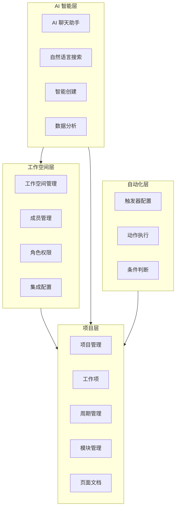
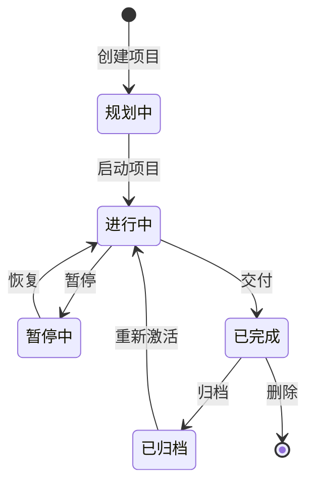
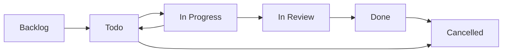
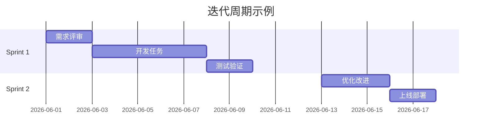
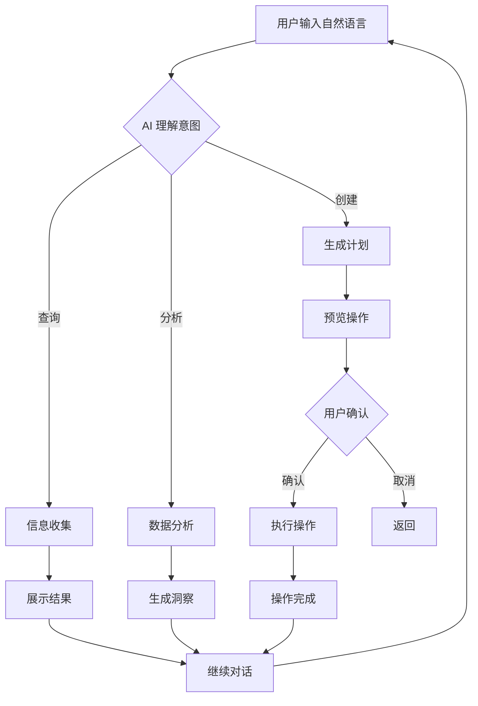
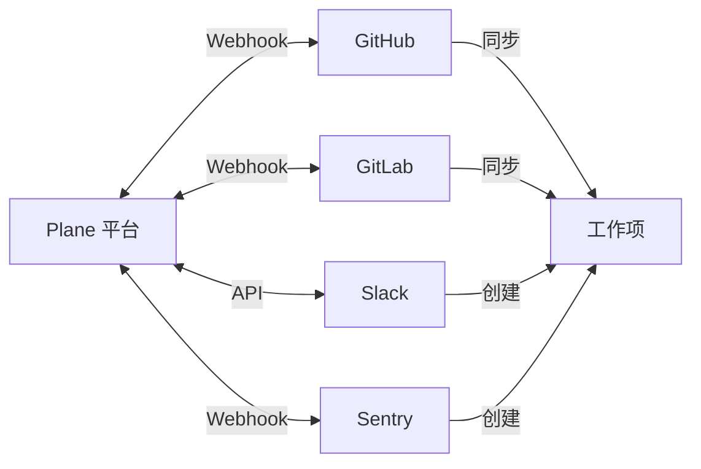
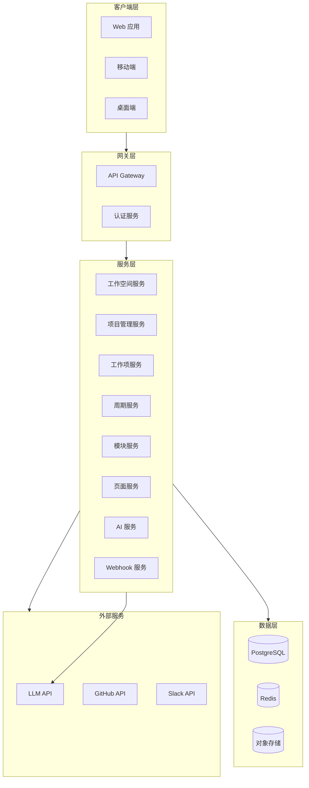
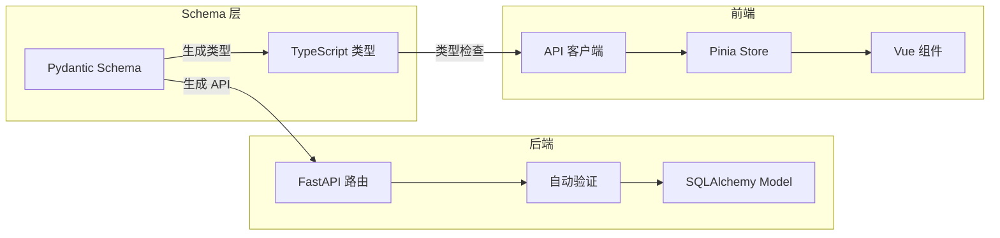
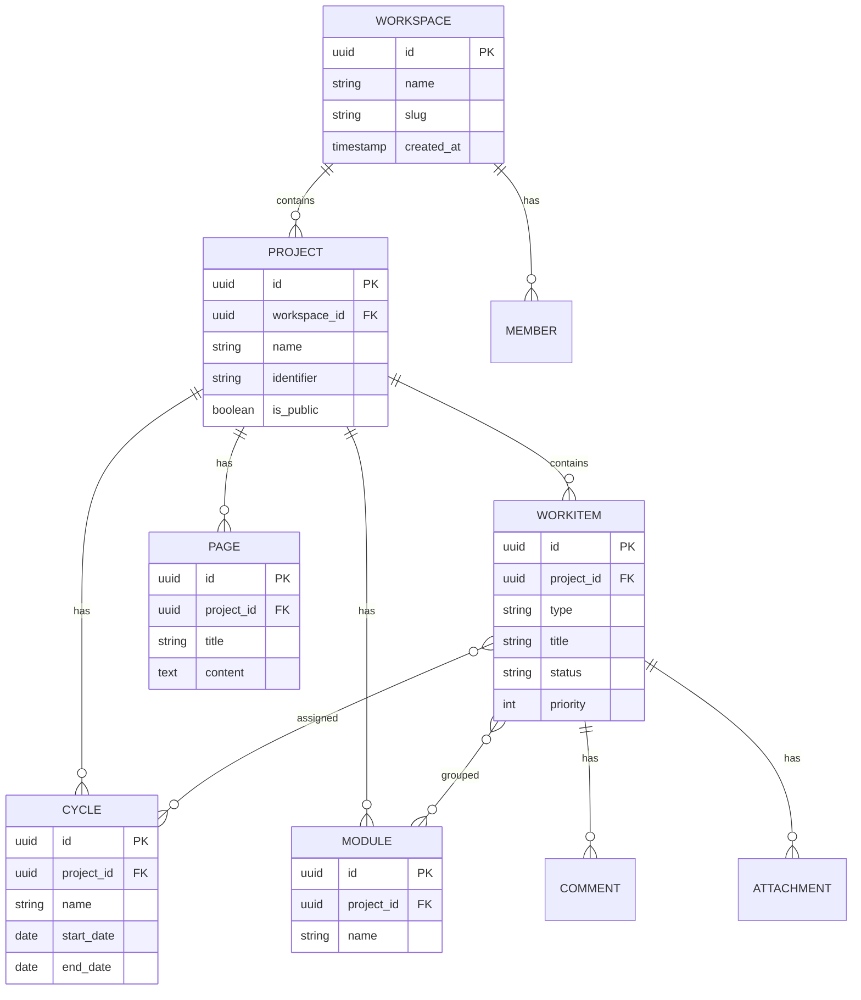
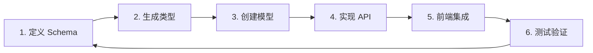

# Plane AI 产品需求文档

---

## 1. 产品概述

Plane 是一款现代化的项目管理平台，旨在帮助团队高效地规划、跟踪和交付工作。该平台提供了灵活的工作空间管理、直观的看板视图、强大的自动化能力和 AI 智能助手，让团队能够在一个统一的平台上完成从项目规划到交付的全流程管理。

### 1.1 核心价值

- **统一的工作中心**：将项目、工作项、文档和团队协作整合在一个平台
- **灵活的定制能力**：支持自定义工作项类型、工作流状态、自动化规则
- **AI 驱动的效率**：通过自然语言与项目数据交互，快速获取洞察
- **无缝集成**：与 GitHub、GitLab、Slack 等主流工具深度集成

### 1.2 目标用户

本产品面向需要协作管理项目的各类团队，包括但不限于：

- 软件开发团队
- 产品管理团队
- 设计和创意团队
- 跨职能的项目团队

---

## 2. 功能架构

### 2.1 产品功能矩阵



### 2.2 核心功能模块

| 模块 | 功能数量 | 优先级 | 说明 |
|------|---------|--------|------|
| 工作空间管理 | 8 | P0 | 基础容器，包含所有其他功能 |
| 项目管理 | 10 | P0 | 核心工作组织单元 |
| 工作项管理 | 12 | P0 | 任务、缺陷、需求的载体 |
| 周期与模块 | 6 | P1 | 迭代规划和功能分组 |
| 页面文档 | 8 | P1 | 知识管理和协作写作 |
| AI 智能助手 | 5 | P1 | 自然语言交互能力 |
| 自动化工作流 | 4 | P2 | 规则驱动的自动化 |
| 第三方集成 | 6 | P2 | 外部工具连接能力 |

---

## 3. 工作空间管理

### 3.1 功能概述

工作空间是 Plane 的顶层容器，类似于组织或公司的概念。它包含了团队协作所需的所有资源，包括项目、成员、设置和配置。

### 3.2 核心功能点

| 功能 | 描述 | 用户操作路径 |
|------|------|-------------|
| 创建工作空间 | 首次注册或额外创建新工作空间 | 点击工作空间名称 → 创建工作空间 |
| 工作空间设置 | 配置成员、集成、导入导出 | 工作空间名称 → 设置 |
| 成员管理 | 邀请、移除、分配角色 | 设置 → 成员 |
| 角色权限 | Admin、Member、Guest 三级权限 | 设置 → 角色管理 |
| 工作空间切换 | 多工作空间快速切换 | 工作空间名称 → 选择 |
| 删除工作空间 | 永久删除（需 Admin 权限） | 设置 → 通用 → 删除工作空间 |

### 3.3 成员角色说明

| 角色 | 权限范围 | 适用场景 |
|------|---------|---------|
| Admin | 完全控制权 | 团队负责人、项目经理 |
| Member | 创建和编辑资源 | 团队成员、开发者 |
| Guest | 只读或受限访问 | 外部协作者、客户 |

### 3.4 工作空间数据流


---

## 4. 项目管理

### 4.1 功能概述

项目是组织团队工作的核心单元。每个项目可以包含工作项、周期、模块、页面等资源，用于达成特定的业务目标。

### 4.2 核心功能点

| 功能 | 描述 | 快捷键 |
|------|------|--------|
| 创建项目 | 新建项目并配置基本信息 | N → P |
| 设置可见性 | Public（公开）或 Private（私有） | 项目设置 |
| 配置项目 | 标识符、时区、功能开关 | 项目设置 |
| 启用功能 | Cycles、Modules、Views 等 | 项目设置 → 功能 |
| 归档项目 | 保留数据但隐藏显示 | 项目设置 |
| 恢复项目 | 从归档状态恢复 | 项目列表 |
| 删除项目 | 永久删除（需确认） | 项目设置 |

### 4.3 项目配置项

| 配置项 | 说明 | 示例 |
|--------|------|------|
| 项目名称 | 清晰描述项目目的 | 用户认证系统 |
| 项目标识符 | 唯一代码，附加到所有工作项 | UA-123 |
| 可见性 | 控制谁可以访问 | Public / Private |
| 时区 | 用于时间计算 | Asia/Shanghai |
| 功能开关 | 启用/禁用 Cycles、Modules 等 | 启用 Cycles |

### 4.4 项目生命周期



---

## 5. 工作项管理

### 5.1 功能概述

工作项是项目中最基本的任务载体。Plane 支持多种工作项类型，包括 Issue（问题）、Task（任务）、Bug（缺陷）等，每种类型都可以自定义状态、优先级和字段。

### 5.2 核心功能点

| 功能 | 描述 |
|------|------|
| 创建工作项 | 快速创建任务、缺陷或功能 |
| 分配负责人 | 指定工作项的处理人 |
| 设置状态 | 从待办、进行中到已完成 |
| 设置优先级 | Urgent、High、Medium、Low |
| 添加标签 | 自定义分类标签 |
| 描述详情 | 富文本描述，支持 Markdown |
| 关联 Cycle | 将工作项分配到迭代 |
| 关联 Module | 按功能模块分组 |
| 关联页面 | 附加相关文档 |
| 评论协作 | 在工作项下讨论 |
| 附件上传 | 添加文件附件 |
| 活动日志 | 查看变更历史 |

### 5.3 工作项状态流



### 5.4 工作项类型定义

| 类型 | 用途 | 典型场景 |
|------|------|---------|
| Issue | 通用问题或任务 | 需求、功能点 |
| Task | 具体执行任务 | 代码实现、文档撰写 |
| Bug | 缺陷报告 | 错误修复 |
| Story | 用户故事 | 敏捷开发 |
| Epic | 大型功能集 | 长期规划 |

### 5.5 自定义字段（Custom Properties）

自定义字段允许用户为不同的工作项类型添加特定的属性，实现更灵活的数据管理。

#### 5.5.1 字段类型

| 字段类型 | 属性 | 说明 |
|----------|------|------|
| **文本** | 单行、段落、只读 | 用于短文本或长描述 |
| **数字** | 默认值 | 用于计数、估算等数值 |
| **下拉** | 单选、多选 | 预定义选项列表 |
| **布尔** | True/False | 用于开关类属性 |
| **日期** | 日期格式 | 用于日期选择 |
| **成员选择器** | 单选、多选 | 关联项目成员 |
| **发布选择器** | 多选 | 关联发布版本 |
| **URL** | 链接 | 用于外部资源链接 |

#### 5.5.2 核心功能点

| 功能 | 描述 |
|------|------|
| 创建自定义字段 | 为工作项类型添加自定义属性 |
| 设置字段属性 | 必填、可选、只读 |
| 设置默认值 | 为数字、下拉等字段设置默认值 |
| 管理下拉选项 | 添加、编辑、删除下拉选项 |
| 字段值更新 | 在工作项中更新自定义字段值 |
| 活动追踪 | 记录自定义字段的变更历史 |

#### 5.5.3 自定义字段示例

**Bug 类型自定义字段：**
- 受影响版本 (下拉)
- 解决版本 (下拉)
- 环境 (下拉: 开发、测试、生产)
- 复现步骤 (段落文本)
- 审批状态 (下拉)

**产品发布类型字段：**
- 发布日期 (日期)
- 目标市场 (下拉，多选)
- 预算 (数字)
- 审批状态 (下拉)
- 负责人 (成员选择器)

#### 5.5.4 字段验证规则

- 必填字段在工作项创建时必须填写
- 只读字段不可编辑
- 数字字段可设置有效范围
- 下拉字段可设置是否允许多选

---

## 6. 周期管理

### 6.1 功能概述

周期（Cycle）是用于组织和管理迭代工作的功能。它帮助团队在固定的时间盒内完成一组相关的工作项，类似于 Scrum 中的 Sprint。

### 6.2 核心功能点

| 功能 | 描述 |
|------|------|
| 创建周期 | 设置名称、时间范围 |
| 分配工作项 | 将工作项纳入周期 |
| 跟踪进度 | 查看周期完成率 |
| 开始/结束周期 | 控制周期的活跃状态 |
| 周期报告 | 燃尽图、统计视图 |
| 周期模板 | 复用周期配置 |

### 6.3 周期视图



---

## 7. 模块管理

### 7.1 功能概述

模块用于按功能或业务领域对工作项进行分组。与周期的时间维度不同，模块是功能维度的组织方式。

### 7.2 核心功能点

| 功能 | 描述 |
|------|------|
| 创建模块 | 定义功能模块名称 |
| 添加工作项 | 将相关工作项纳入模块 |
| 模块进度 | 查看模块整体完成度 |
| 模块成员 | 指定负责人 |
| 模块时间线 | 设置目标和截止日期 |

---

## 8. 页面与文档

### 8.1 功能概述

页面（Pages）是 Plane 的文档和知识管理工具。团队可以用它来撰写产品规格、会议记录、团队规范等，并支持实时协作。

### 8.2 核心功能点

| 功能 | 描述 |
|------|------|
| 创建页面 | 新建空白页面 |
| 富文本编辑 | 格式化文本、列表、表格 |
| Markdown 支持 | 完整的 Markdown 语法 |
| AI 辅助 | AI 帮助生成内容、总结、翻译 |
| 提及工作项 | 在文档中 @ 提及工作项 |
| 块操作 | 复制链接、复制、删除块 |
| 转换工作项 | 将文本快速转为工作项 |
| 全宽模式 | 扩展编辑区域 |
| 页面锁定 | 防止意外编辑 |
| 版本历史 | 查看和恢复历史版本 |
| 导出功能 | 导出为 Markdown、PDF |
| 移动页面 | 调整页面层级结构 |

### 8.3 页面编辑器功能

```mermaid
flowchart TB
    A[页面编辑器] --> B[文本格式]
    A --> C[AI 助手]
    A --> D[提及引用]
    A --> E[块操作]
    
    B --> B1[标题/列表/表格]
    C --> C1[生成内容]
    C --> C2[总结要点]
    C --> C3[翻译语言]
    D --> D1[@工作项]
    D --> D2[链接跳转]
    E --> E1[复制/删除]
    E --> E2[转工作项]
```

---

## 9. AI 智能助手

### 9.1 功能概述

Plane AI 是集成在平台中的 AI 助手，允许用户通过自然语言与项目数据交互，快速获取信息、创建内容、执行操作。

### 9.2 核心功能点

| 功能 | 描述 |
|------|------|
| AI 聊天 | 通过对话询问项目问题 |
| 自然语言搜索 | 用日常语言搜索工作项 |
| 智能创建 | 描述需求，AI 生成工作项 |
| 数据分析 | AI 分析项目进度和趋势 |
| 上下文感知 | AI 理解当前项目、页面上下文 |

### 9.3 AI 对话模式

| 模式 | 用途 |
|------|------|
| Ask 模式 | 查询信息、获取答案 |
| Build 模式 | 创建工作项、执行操作 |

### 9.4 AI 操作流程



---

## 14. 自动化工作流

### 14.1 功能概述

Plane 支持灵活的自动化规则，帮助团队减少重复性操作。当满足特定条件时，自动执行预定义的动作。

### 14.2 自动化组件

| 组件 | 说明 |
|------|------|
| 触发器 | 定义何时触发自动化 |
| 条件 | 筛选目标对象 |
| 动作 | 执行的自动化操作 |

### 14.3 常见自动化场景

| 场景 | 触发 | 动作 |
|------|------|------|
| 自动分配 | 新建工作项 | 分配给负责人 |
| 状态同步 | 工作项完成 | 更新相关工作项 |
| 通知提醒 | 截止日期临近 | 发送提醒 |
| 标签管理 | 指定条件 | 自动添加标签 |

---

## 15. 时间跟踪

### 15.1 功能概述

Plane 提供原生的时间跟踪功能，让团队记录和管理工作时间。

### 15.2 核心功能点

| 功能 | 描述 |
|------|------|
| **时间记录** | 手动或自动记录工作时间 |
| **时间估算** | 设置工作项预估时间 |
| **时间报告** | 查看时间统计和趋势 |
| **时间审批** | 时间记录审批流程 |

---

## 16. 自定义仪表板

### 16.1 功能概述

自定义仪表板让团队创建个性化的数据视图，实时监控项目进度和团队绩效。

### 16.2 核心功能点

| 功能 | 描述 |
|------|------|
| **仪表板创建** | 自定义仪表板布局 |
| **图表组件** | 多种图表类型（柱状图、饼图、折线图） |
| **数据筛选** | 按项目、周期、成员筛选 |
| **实时更新** | 数据实时同步更新 |
| **工作空间分析** | 整体工作空间数据分析 |

---

## 17. Command K 导航

### 17.1 功能概述

Command K 是 Plane 的键盘优先快速操作界面，让用户通过快捷键快速导航和执行操作。

### 17.2 核心功能点

| 功能 | 描述 |
|------|------|
| **快速搜索** | 搜索工作项、项目、页面 |
| **快速导航** | 快速跳转到任意页面 |
| **快速操作** | 创建、更新、删除工作项 |
| **快捷键支持** | 全键盘操作支持 |

---

## 18. 第三方集成

### 18.1 功能概述

Plane 提供了丰富的原生集成，可以与团队日常使用的工具无缝连接，避免在多个平台间切换。

### 18.2 支持的集成

| 集成 | 功能 |
|------|------|
| GitHub | 同步 Issue 和 Pull Request |
| GitHub Enterprise | 企业版 GitHub 集成 |
| GitLab | 自动化 MR 跟踪 |
| Slack | 创建工作项、同步讨论 |
| Sentry | 自动创建工作项、同步错误 |
| Draw.io | 在页面中嵌入图表 |
| Jira | 数据导入和迁移 |
| API/Webhooks | 自定义集成 |

### 18.3 集成架构



---

## 19. 审计与合规

### 19.1 功能概述

Plane 提供完整的审计日志和合规记录功能，满足企业合规性要求。

### 19.2 核心功能点

| 功能 | 描述 |
|------|------|
| **审计日志** | 记录所有操作历史 |
| **合规记录** | 合规性检查记录 |
| **数据导出** | 导出审计数据 |
| **访问控制** | 基于角色的审计数据访问 |

---

## 20. 企业认证

### 20.1 功能概述

Plane 支持多种企业级认证方式，满足组织的安全和合规要求。

### 20.2 支持的认证方式

| 认证方式 | 描述 |
|---------|------|
| **SSO** | 单点登录支持 |
| **SAML** | SAML 2.0 认证 |
| **OIDC** | OpenID Connect 认证 |
| **LDAP** | LDAP/Active Directory 集成 |

---

## 21. 用户界面设计

### 21.1 设计原则

- **清晰直观**：重要信息一目了然
- **高效操作**：减少点击次数，快捷键支持
- **一致性**：统一的视觉语言和交互模式
- **响应式**：适配桌面、平板、移动设备

### 21.2 配色方案

| 用途 | 艱值 | 说明 |
|------|------|------|
| 主色调 | #6366F1 | Indigo，用于主要按钮和强调 |
| 辅助色 | #8B5CF6 | 紫色，用于 AI 相关功能 |
| 成功色 | #10B981 | 绿色，表示完成状态 |
| 警告色 | #F59E0B | 橙色，表示待处理 |
| 错误色 | #EF4444 | 红色，表示错误或紧急 |
| 背景色 | #FFFFFF / #F9FAFB | 白色/浅灰 |
| 文字色 | #111827 / #6B7280 | 深灰/中灰 |

### 21.3 布局结构

| 区域 | 内容 |
|------|------|
| 侧边栏 | 工作空间、项目、周期、模块、页面导航 |
| 顶部栏 | 搜索、AI 助手、通知、用户菜单 |
| 主内容区 | 工作项列表、看板、详情页面 |
| 右面板 | 工作项详情、评论区（可收起） |

---

## 22. 技术架构

### 22.1 系统架构



### 22.2 技术栈选型

本项目采用 **Vue3 + Python3 + FastAPI（异步） + SDD（Schema-Driven Development）** 模式。

| 层级 | 技术 | 说明 |
|------|------|------|
| 前端框架 | Vue 3 + Composition API | 组件化开发，响应式系统 |
| 构建工具 | Vite | 快速开发体验 |
| 样式方案 | TailwindCSS | 原子化 CSS |
| 状态管理 | Pinia | Vue3 官方推荐状态管理 |
| 前端类型 | TypeScript | 类型安全 |
| 后端框架 | FastAPI（异步） | 高性能异步 Python 框架 |
| 数据验证 | Pydantic V2 | Schema 驱动的数据验证 |
| 数据库 ORM | SQLAlchemy 2.0（异步） | 异步 ORM 支持 |
| 数据库 | PostgreSQL 16+ | 关系型数据 |
| 缓存 | Redis（aioredis） | 异步 Redis 客户端 |
| 文件存储 | S3 兼容存储 | 附件和文件 |
| API 文档 | OpenAPI（内置） | 自动生成 API 文档 |
| 后台任务 | ARQ / BackgroundTasks | 异步任务处理 |
| AI 集成 | OpenAI / Claude | LLM 支持 |
| 实时通信 | WebSocket | 实时协作 |

### 22.2.1 SDD（Schema-Driven Development）模式

Schema-Driven Development 是一种以数据 Schema 为核心的开发模式：

- **Schema 作为契约**：前后端共享同一套数据定义（Pydantic Schema）
- **自动生成**：从 Pydantic Schema 自动生成 TypeScript 类型、API 文档
- **类型安全**：全链路类型检查，减少运行时错误
- **文档同步**：Schema 即文档，保持一致性



### 22.3 数据库模型



---

## 23. 非功能需求

### 23.1 性能指标

| 指标 | 目标值 |
|------|--------|
| 页面加载时间 | < 2 秒 |
| API 响应时间 | < 500ms |
| AI 对话响应时间 | < 5 秒 |
| 并发用户数 | 支持 1000+ |

### 23.2 安全需求

- 所有数据传输使用 HTTPS 加密
- 敏感数据静态加密存储
- 基于角色的访问控制（RBAC）
- 操作审计日志
- 支持 SSO/SAML 企业认证

### 23.3 可用性需求

- 服务可用性 99.9%
- 支持多时区、多语言
- 完善的错误提示和帮助文档
- 数据备份和恢复机制

---

## 24. 实施计划

### 24.1 SDD 开发流程

基于 Schema-Driven Development 模式，开发流程遵循以下顺序：



### 24.2 开发阶段划分

| 阶段 | 功能范围 | 主要任务 | 输出 |
|------|---------|---------|------|
| Phase 1 | Schema 定义 + 数据库 | Pydantic Schema、SQLAlchemy Model、Alembic 迁移 | 数据层完成 |
| Phase 2 | 础 API + 认证 | FastAPI 路由、JWT 认证、权限控制 | API 层完成 |
| Phase 3 | 前端基础架构 | Vue3 项目初始化、Pinia Store、API 客户端 | 前端框架完成 |
| Phase 4 | 核心功能开发 | 工作项、项目、周期、模块 CRUD | 核心功能可用 |
| Phase 5 | AI 功能集成 | AI 聊天、搜索、智能创建 | AI 功能可用 |
| Phase 6 | 自动化与集成 | Webhook、GitHub/Slack 集成 | 集成完成 |
| Phase 7 | 测试与优化 | 单元测试、性能优化、文档完善 | 上线准备 |

### 24.3 优先级排序

| 优先级 | 功能 | 依赖关系 | Schema 定义 |
|--------|------|---------|------------|
| P0 | Pydantic Schema 定义 | 无 | UserSchema, WorkspaceSchema, ProjectSchema, IssueSchema |
| P0 | SQLAlchemy 模型 | Schema | User, Workspace, Project, Issue, State |
| P0 | 认证系统（JWT） | User 模型 | AuthSchema, TokenSchema |
| P0 | 工作空间 API | Workspace 模型 | WorkspaceCreate, WorkspaceUpdate, WorkspaceResponse |
| P0 | 项目 API | Project 模型 | ProjectCreate, ProjectUpdate, ProjectResponse |
| P0 | 工作项 CRUD | Issue 模型 | IssueCreate, IssueUpdate, IssueResponse |
| P0 | 视图系统 | Issue 模型 | ViewSchema, FilterSchema |
| P1 | 周期管理 | Cycle 模型 | CycleCreate, CycleUpdate, CycleResponse |
| P1 | 模块管理 | Module 模型 | ModuleCreate, ModuleUpdate, ModuleResponse |
| P1 | 层级结构 | Epic 模型 | InitiativeSchema, EpicSchema |
| P1 | Intake 与 Triage | Issue 模型 | IntakeSchema, TriageSchema |
| P1 | 工作流与审批 | State 模型 | WorkflowSchema, ApprovalSchema |
| P1 | AI 聊天基础 | Issue 查询 API | AIRequest, AIResponse, AIThread |
| P1 | AI 工作项创建 | Issue 创建 API | AIAction, AIPlan |
| P2 | 页面与 Wiki | Page 模型 | PageCreate, PageUpdate, PageResponse |
| P2 | 自动化规则 | Issue 模型 | AutomationSchema, TriggerSchema |
| P2 | 时间跟踪 | Issue 模型 | TimeTrackSchema |
| P2 | 自定义仪表板 | Analytics | DashboardSchema |
| P2 | Command K 导航 | Search | CommandKSchema |
| P2 | 第三方集成 | Webhook | IntegrationSchema, WebhookSchema |
| P3 | 审计与合规 | Audit | AuditLogSchema |
| P3 | 企业认证 | Auth | SSOSchema, SAMLSchema |

### 24.4 技术实现要点

| 模块 | 关键技术 | 说明 |
|------|---------|------|
| Schema 定义 | Pydantic V2 | 使用 `BaseModel` + `ConfigDict(from_attributes=True)` |
| 数据库模型 | SQLAlchemy 2.0 | 使用 `Mapped` + `mapped_column` 异步语法 |
| API 路由 | FastAPI | 使用 `APIRouter` + `Depends` 依赖注入 |
| 认证 | JWT + OAuth2 | 使用 `python-jose` + `passlib` |
| 类型生成 | openapi-typescript | 从 OpenAPI 自动生成 TypeScript 类型 |
| 状态管理 | Pinia | 使用 `defineStore` + Composition API |
| 前端组件 | Vue3 SFC | 使用 `<script setup>` 语法 |

---

**文档版本**：v4.0（完整特性 + Vue3 + FastAPI + SDD 模式）  
**创建日期**：2026-06-13  
**参考来源**：https://docs.plane.so/  
**参考代码**：D:\code\plane