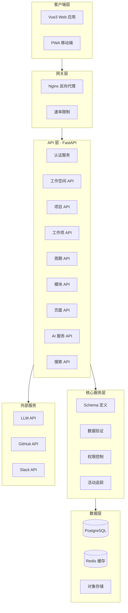
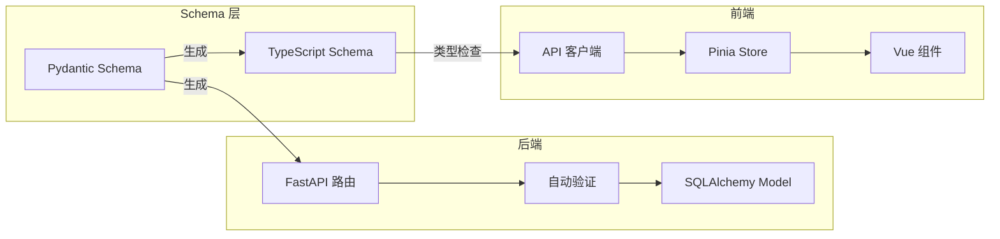

# Plane AI 技术架构文档

---

## 1. 架构概述

基于 Plane 原版代码分析，采用 **Vue3 + Python3 + FastAPI（异步） + SDD（Schema-Driven Development）** 模式重新设计。

### 1.1 SDD 模式核心理念

Schema-Driven Development（SDD）是一种以数据 Schema 为核心的开发模式：

- **Schema 作为契约**：前后端共享同一套数据定义
- **自动生成**：从 Schema 自动生成 API、类型、验证逻辑
- **类型安全**：全链路类型检查，减少运行时错误
- **文档同步**：Schema 即文档，保持一致性

### 1.2 技术栈对比

| 层级 | Plane 原版 | 本项目 |
|------|-----------|--------|
| 前端框架 | React 18 | Vue 3 + Composition API |
| 前端构建 | Vite | Vite |
| 前端类型 | TypeScript | TypeScript |
| 状态管理 | Zustand | Pinia |
| 后端框架 | Django + DRF | FastAPI（异步） |
| 数据库 ORM | Django ORM | SQLAlchemy 2.0（异步） |
| 数据验证 | Django Forms | Pydantic V2 |
| API 文档 | drf-spectacular | OpenAPI（内置） |
| 后台任务 | Celery | ARQ / BackgroundTasks |
| 缓存 | Redis | Redis（aioredis） |

---

## 2. 系统架构

### 2.1 整体架构图



### 2.2 SDD 数据流



---

## 3. 项目结构

### 3.1 目录结构

```
planepy/
├── frontend/                    # Vue3 前端
│   ├── src/
│   │   ├── api/                 # API 客户端（自动生成）
│   │   ├── components/          # Vue 组件
│   │   │   ├── common/          # 通用组件
│   │   │   ├── workspace/       # 工作空间组件
│   │   │   ├── project/         # 项目组件
│   │   │   ├── issue/           # 工作项组件
│   │   │   ├── cycle/           # 周期组件
│   │   │   ├── module/          # 模块组件
│   │   │   ├── page/            # 页面组件
│   │   │   └── ai/              # AI 组件
│   │   ├── composables/         # Vue Composition API
│   │   ├── stores/              # Pinia 状态管理
│   │   ├── types/               # TypeScript 类型（自动生成）
│   │   ├── views/               # 页面视图
│   │   ├── router/              # Vue Router
│   │   ├── utils/               # 工具函数
│   │   ├── constants/           # 常量定义
│   │   └── i18n/                # 国际化
│   ├── public/
│   ├── tests/
│   ├── vite.config.ts
│   ├── tsconfig.json
│   └── package.json
│
├── backend/                     # FastAPI 后端
│   ├── app/
│   │   ├── api/                 # API 路由
│   │   │   ├── v1/
│   │   │   │   ├── endpoints/
│   │   │   │   │   ├── auth.py
│   │   │   │   │   ├── workspace.py
│   │   │   │   │   ├── project.py
│   │   │   │   │   ├── issue.py
│   │   │   │   │   ├── cycle.py
│   │   │   │   │   ├── module.py
│   │   │   │   │   ├── page.py
│   │   │   │   │   ├── ai.py
│   │   │   │   │   └── search.py
│   │   │   │   └── router.py
│   │   │   └── deps.py          # 依赖注入
│   │   ├── core/                # 核心配置
│   │   │   ├── config.py
│   │   │   ├── security.py
│   │   │   ├── permissions.py
│   │   │   └── exceptions.py
│   │   ├── models/              # SQLAlchemy 模型
│   │   │   ├── base.py
│   │   │   ├── user.py
│   │   │   ├── workspace.py
│   │   │   ├── project.py
│   │   │   ├── issue.py
│   │   │   ├── cycle.py
│   │   │   ├── module.py
│   │   │   ├── page.py
│   │   │   └── state.py
│   │   ├── schemas/             # Pydantic Schema（核心）
│   │   │   ├── base.py
│   │   │   ├── user.py
│   │   │   ├── workspace.py
│   │   │   ├── project.py
│   │   │   ├── issue.py
│   │   │   ├── cycle.py
│   │   │   ├── module.py
│   │   │   ├── page.py
│   │   │   ├── ai.py
│   │   │   └── common.py
│   │   ├── services/            # 业务服务
│   │   │   ├── auth.py
│   │   │   ├── workspace.py
│   │   │   ├── project.py
│   │   │   ├── issue.py
│   │   │   ├── cycle.py
│   │   │   ├── module.py
│   │   │   ├── page.py
│   │   │   ├── ai.py
│   │   │   └── activity.py
│   │   ├── repositories/        # 数据访问层
│   │   │   ├── base.py
│   │   │   ├── user.py
│   │   │   ├── workspace.py
│   │   │   ├── project.py
│   │   │   ├── issue.py
│   │   │   └── cycle.py
│   │   ├── tasks/               # 后台任务
│   │   │   ├── activity.py
│   │   │   ├── webhook.py
│   │   │   └── notification.py
│   │   ├── utils/               # 工具函数
│   │   ├── db/                  # 数据库配置
│   │   │   ├── session.py
│   │   │   └── migrations/
│   │   └── main.py              # 应用入口
│   ├── tests/
│   ├── alembic.ini
│   ├── pyproject.toml
│   └── requirements.txt
│
├── schemas/                     # 共享 Schema（SDD 核心）
│   ├── openapi.yaml             # OpenAPI 规范
│   ├── typescript/              # 生成的 TypeScript 类型
│   └── python/                  # 生成的 Python Schema
│
├── docs/                        # 文档
│   ├── PRD.md
│   ├── TECH_ARCHITECTURE.md
│   └── API.md
│
├── docker/                      # Docker 配置
│   ├── Dockerfile.frontend
│   ├── Dockerfile.backend
│   └── docker-compose.yml
│
└── scripts/                     # 脚本
    ├── generate_types.py        # 类型生成脚本
    └── init_db.py               # 数据库初始化
```

---

## 4. Schema 定义（SDD 核心）

### 4.1 基础 Schema

```python
# backend/app/schemas/base.py
from datetime import datetime
from uuid import UUID
from pydantic import BaseModel, ConfigDict, Field
from typing import Optional, Any

class BaseSchema(BaseModel):
    """基础 Schema 配置"""
    model_config = ConfigDict(
        from_attributes=True,
        populate_by_name=True,
        use_enum_values=True,
    )

class TimestampSchema(BaseSchema):
    """时间戳 Schema"""
    created_at: datetime
    updated_at: datetime

class UUIDSchema(BaseSchema):
    """UUID Schema"""
    id: UUID = Field(default_factory=UUID)

class AuditSchema(UUIDSchema, TimestampSchema):
    """审计 Schema"""
    created_by: Optional[UUID] = None
    updated_by: Optional[UUID] = None

class SoftDeleteSchema(BaseSchema):
    """软删除 Schema"""
    deleted_at: Optional[datetime] = None
    is_deleted: bool = False
```

### 4.2 用户 Schema

```python
# backend/app/schemas/user.py
from pydantic import BaseModel, EmailStr, Field
from typing import Optional, List
from datetime import datetime
from uuid import UUID
from .base import AuditSchema

class UserBase(BaseModel):
    """用户基础信息"""
    email: EmailStr
    username: str = Field(..., min_length=3, max_length=128)
    display_name: Optional[str] = None
    first_name: Optional[str] = None
    last_name: Optional[str] = None
    user_timezone: str = "UTC"

class UserCreate(UserBase):
    """创建用户"""
    password: str = Field(..., min_length=8)

class UserUpdate(BaseModel):
    """更新用户"""
    display_name: Optional[str] = None
    first_name: Optional[str] = None
    last_name: Optional[str] = None
    avatar: Optional[str] = None
    user_timezone: Optional[str] = None

class UserResponse(AuditSchema, UserBase):
    """用户响应"""
    is_active: bool
    is_email_verified: bool
    avatar_url: Optional[str] = None
    cover_image_url: Optional[str] = None
    last_active: Optional[datetime] = None

class UserLite(BaseModel):
    """用户精简信息"""
    id: UUID
    display_name: str
    email: EmailStr
    avatar_url: Optional[str] = None
```

### 4.3 工作空间 Schema

```python
# backend/app/schemas/workspace.py
from pydantic import BaseModel, Field
from typing import Optional
from uuid import UUID
from .base import AuditSchema
from .user import UserLite, UserResponse
from enum import IntEnum

class WorkspaceRole(IntEnum):
    """工作空间角色"""
    ADMIN = 20
    MEMBER = 15
    GUEST = 5

class WorkspaceBase(BaseModel):
    """工作空间基础"""
    name: str = Field(..., min_length=1, max_length=255)
    slug: str = Field(..., min_length=1, max_length=50, pattern=r'^[a-z0-9-]+$')
    organization_size: Optional[str] = None
    timezone: str = "UTC"

class WorkspaceCreate(WorkspaceBase):
    """创建工作空间"""
    pass

class WorkspaceUpdate(BaseModel):
    """更新工作空间"""
    name: Optional[str] = None
    logo_url: Optional[str] = None
    timezone: Optional[str] = None

class WorkspaceResponse(AuditSchema, WorkspaceBase):
    """工作空间响应"""
    owner: UserResponse
    total_members: int
    total_projects: int
    logo_url: Optional[str] = None

class WorkspaceLite(BaseModel):
    """工作空间精简"""
    id: UUID
    name: str
    slug: str

class WorkspaceMemberBase(BaseModel):
    """工作空间成员基础"""
    role: WorkspaceRole

class WorkspaceMemberCreate(WorkspaceMemberBase):
    """创建成员"""
    member_id: UUID

class WorkspaceMemberResponse(AuditSchema, WorkspaceMemberBase):
    """成员响应"""
    member: UserLite
    is_active: bool
    joining_date: Optional[str] = None
```

### 4.4 项目 Schema

```python
# backend/app/schemas/project.py
from pydantic import BaseModel, Field
from typing import Optional, List
from uuid import UUID
from datetime import datetime
from .base import AuditSchema, SoftDeleteSchema
from .user import UserLite
from .workspace import WorkspaceLite

class ProjectBase(BaseModel):
    """项目基础"""
    name: str = Field(..., min_length=1, max_length=255)
    identifier: str = Field(..., min_length=1, max_length=10, pattern=r'^[A-Z]+$')
    description: Optional[str] = None
    is_public: bool = False
    timezone: str = "UTC"

class ProjectCreate(ProjectBase):
    """创建项目"""
    default_assignee_id: Optional[UUID] = None

class ProjectUpdate(BaseModel):
    """更新项目"""
    name: Optional[str] = None
    description: Optional[str] = None
    is_public: Optional[bool] = None
    archived_at: Optional[datetime] = None

class ProjectResponse(AuditSchema, SoftDeleteSchema, ProjectBase):
    """项目响应"""
    workspace: WorkspaceLite
    total_issues: int
    total_members: int
    default_assignee: Optional[UserLite] = None
    logo_url: Optional[str] = None
    is_favorite: bool = False

class ProjectLite(BaseModel):
    """项目精简"""
    id: UUID
    name: str
    identifier: str
```

### 4.5 工作项 Schema

```python
# backend/app/schemas/issue.py
from pydantic import BaseModel, Field
from typing import Optional, List, Dict, Any
from uuid import UUID
from datetime import datetime, date
from enum import Enum
from .base import AuditSchema, SoftDeleteSchema
from .user import UserLite
from .project import ProjectLite

class IssuePriority(str, Enum):
    """工作项优先级"""
    URGENT = "urgent"
    HIGH = "high"
    MEDIUM = "medium"
    LOW = "low"
    NONE = "none"

class IssueType(str, Enum):
    """工作项类型"""
    ISSUE = "issue"
    TASK = "task"
    BUG = "bug"
    STORY = "story"
    EPIC = "epic"

class IssueBase(BaseModel):
    """工作项基础"""
    name: str = Field(..., min_length=1, max_length=255)
    description_html: str = "<p></p>"
    description_json: Dict[str, Any] = {}
    priority: IssuePriority = IssuePriority.NONE
    start_date: Optional[date] = None
    target_date: Optional[date] = None

class IssueCreate(IssueBase):
    """创建工作项"""
    parent_id: Optional[UUID] = None
    state_id: Optional[UUID] = None
    assignee_ids: Optional[List[UUID]] = []
    label_ids: Optional[List[UUID]] = []
    estimate_point_id: Optional[UUID] = None
    type_id: Optional[UUID] = None
    external_id: Optional[str] = None
    external_source: Optional[str] = None

class IssueUpdate(BaseModel):
    """更新工作项"""
    name: Optional[str] = None
    description_html: Optional[str] = None
    priority: Optional[IssuePriority] = None
    state_id: Optional[UUID] = None
    assignee_ids: Optional[List[UUID]] = None
    label_ids: Optional[List[UUID]] = None
    start_date: Optional[date] = None
    target_date: Optional[date] = None
    estimate_point_id: Optional[UUID] = None
    cycle_id: Optional[UUID] = None
    module_ids: Optional[List[UUID]] = None

class IssueResponse(AuditSchema, SoftDeleteSchema, IssueBase):
    """工作项响应"""
    project: ProjectLite
    sequence_id: int
    state_id: UUID
    state_name: str
    state_group: str
    assignees: List[UserLite]
    labels: List[UUID]
    sub_issues_count: int
    link_count: int
    attachment_count: int
    completed_at: Optional[datetime] = None
    is_draft: bool = False
    parent_id: Optional[UUID] = None
    estimate_point_id: Optional[UUID] = None
    cycle_id: Optional[UUID] = None
    module_ids: List[UUID] = []

class IssueLite(BaseModel):
    """工作项精简"""
    id: UUID
    name: str
    sequence_id: int
    priority: IssuePriority
    state_id: UUID
    project_id: UUID
    project_identifier: str

class IssueSearchResult(BaseModel):
    """搜索结果"""
    id: UUID
    name: str
    sequence_id: int
    project_identifier: str
    project_id: UUID
    workspace_slug: str
```

### 4.6 周期 Schema

```python
# backend/app/schemas/cycle.py
from pydantic import BaseModel, Field
from typing import Optional, Dict, Any
from uuid import UUID
from datetime import datetime
from .base import AuditSchema, SoftDeleteSchema
from .user import UserLite
from .project import ProjectLite

class CycleBase(BaseModel):
    """周期基础"""
    name: str = Field(..., min_length=1, max_length=255)
    description: Optional[str] = None
    start_date: Optional[datetime] = None
    end_date: Optional[datetime] = None
    timezone: str = "UTC"

class CycleCreate(CycleBase):
    """创建周期"""
    project_id: UUID

class CycleUpdate(BaseModel):
    """更新周期"""
    name: Optional[str] = None
    description: Optional[str] = None
    start_date: Optional[datetime] = None
    end_date: Optional[datetime] = None
    archived_at: Optional[datetime] = None

class CycleResponse(AuditSchema, SoftDeleteSchema, CycleBase):
    """周期响应"""
    project: ProjectLite
    owned_by: UserLite
    total_issues: int
    completed_issues: int
    progress_snapshot: Dict[str, Any] = {}
    version: int = 1

class CycleLite(BaseModel):
    """周期精简"""
    id: UUID
    name: str
    start_date: Optional[datetime] = None
    end_date: Optional[datetime] = None
```

### 4.7 AI Schema

```python
# backend/app/schemas/ai.py
from pydantic import BaseModel, Field
from typing import Optional, List, Dict, Any, Literal
from uuid import UUID
from enum import Enum

class AIMode(str, Enum):
    """AI 模式"""
    ASK = "ask"
    BUILD = "build"

class AIIntent(str, Enum):
    """AI 意图"""
    SEARCH = "search"
    CREATE = "create"
    UPDATE = "update"
    ANALYZE = "analyze"
    HELP = "help"

class AIMessage(BaseModel):
    """AI 消息"""
    content: str = Field(..., min_length=1)
    mode: AIMode = AIMode.ASK
    context: Optional[Dict[str, Any]] = None
    attachments: Optional[List[str]] = []

class AIRequest(BaseModel):
    """AI 请求"""
    message: AIMessage
    workspace_id: Optional[UUID] = None
    project_id: Optional[UUID] = None
    thread_id: Optional[UUID] = None

class AIAction(BaseModel):
    """AI 操作"""
    action_type: str
    target_type: str
    target_id: Optional[UUID] = None
    changes: Dict[str, Any] = {}
    description: str

class AIPlan(BaseModel):
    """AI 操作计划"""
    actions: List[AIAction]
    requires_confirmation: bool = True
    estimated_impact: str

class AIResponse(BaseModel):
    """AI 响应"""
    content: str
    intent: AIIntent
    plan: Optional[AIPlan] = None
    results: Optional[List[Dict[str, Any]]] = None
    suggestions: Optional[List[str]] = None
    thread_id: UUID

class AIThread(BaseModel):
    """AI 对话线程"""
    id: UUID
    title: str
    messages: List[Dict[str, Any]]
    created_at: datetime
    updated_at: datetime
```

---

## 5. 数据库模型

### 5.1 基础模型

```python
# backend/app/models/base.py
from datetime import datetime
from uuid import uuid4, UUID
from sqlalchemy import Column, DateTime, Boolean, func
from sqlalchemy.dialects.postgresql import UUID as PG_UUID
from sqlalchemy.ext.asyncio import AsyncAttrs
from sqlalchemy.orm import DeclarativeBase, Mapped, mapped_column

class Base(AsyncAttrs, DeclarativeBase):
    """基础模型"""
    pass

class TimestampMixin:
    """时间戳混入"""
    created_at: Mapped[datetime] = mapped_column(
        DateTime, default=func.now(), nullable=False
    )
    updated_at: Mapped[datetime] = mapped_column(
        DateTime, default=func.now(), onupdate=func.now(), nullable=False
    )

class SoftDeleteMixin:
    """软删除混入"""
    deleted_at: Mapped[datetime | None] = mapped_column(DateTime, nullable=True)
    is_deleted: Mapped[bool] = mapped_column(Boolean, default=False)

class UUIDMixin:
    """UUID 混入"""
    id: Mapped[UUID] = mapped_column(
        PG_UUID(as_uuid=True), primary_key=True, default=uuid4
    )

class AuditMixin(UUIDMixin, TimestampMixin):
    """审计混入"""
    created_by_id: Mapped[UUID | None] = mapped_column(PG_UUID(as_uuid=True), nullable=True)
    updated_by_id: Mapped[UUID | None] = mapped_column(PG_UUID(as_uuid=True), nullable=True)
```

### 5.2 用户模型

```python
# backend/app/models/user.py
from sqlalchemy import String, Boolean, Text
from sqlalchemy.orm import Mapped, mapped_column, relationship
from .base import Base, AuditMixin, SoftDeleteMixin

class User(Base, AuditMixin, SoftDeleteMixin):
    """用户模型"""
    __tablename__ = "users"
    
    email: Mapped[str] = mapped_column(String(255), unique=True, nullable=False)
    username: Mapped[str] = mapped_column(String(128), unique=True, nullable=False)
    display_name: Mapped[str] = mapped_column(String(255), default="")
    first_name: Mapped[str | None] = mapped_column(String(255), nullable=True)
    last_name: Mapped[str | None] = mapped_column(String(255), nullable=True)
    avatar: Mapped[str | None] = mapped_column(Text, nullable=True)
    password_hash: Mapped[str] = mapped_column(String(255), nullable=False)
    
    is_active: Mapped[bool] = mapped_column(Boolean, default=True)
    is_superuser: Mapped[bool] = mapped_column(Boolean, default=False)
    is_email_verified: Mapped[bool] = mapped_column(Boolean, default=False)
    
    user_timezone: Mapped[str] = mapped_column(String(255), default="UTC")
    last_active: Mapped[datetime | None] = mapped_column(DateTime, nullable=True)
    
    # 关系
    workspaces: Mapped[list["WorkspaceMember"]] = relationship(back_populates="user")
    projects: Mapped[list["ProjectMember"]] = relationship(back_populates="user")
```

### 5.3 工作空间模型

```python
# backend/app/models/workspace.py
from sqlalchemy import String, Integer, ForeignKey
from sqlalchemy.orm import Mapped, mapped_column, relationship
from .base import Base, AuditMixin, SoftDeleteMixin

class Workspace(Base, AuditMixin, SoftDeleteMixin):
    """工作空间模型"""
    __tablename__ = "workspaces"
    
    name: Mapped[str] = mapped_column(String(255), nullable=False)
    slug: Mapped[str] = mapped_column(String(50), unique=True, nullable=False)
    logo_url: Mapped[str | None] = mapped_column(String(800), nullable=True)
    organization_size: Mapped[str | None] = mapped_column(String(50), nullable=True)
    timezone: Mapped[str] = mapped_column(String(255), default="UTC")
    owner_id: Mapped[UUID] = mapped_column(ForeignKey("users.id"), nullable=False)
    
    # 关系
    owner: Mapped["User"] = relationship(foreign_keys=[owner_id])
    members: Mapped[list["WorkspaceMember"]] = relationship(back_populates="workspace")
    projects: Mapped[list["Project"]] = relationship(back_populates="workspace")

class WorkspaceMember(Base, AuditMixin, SoftDeleteMixin):
    """工作空间成员"""
    __tablename__ = "workspace_members"
    
    workspace_id: Mapped[UUID] = mapped_column(ForeignKey("workspaces.id"), nullable=False)
    user_id: Mapped[UUID] = mapped_column(ForeignKey("users.id"), nullable=False)
    role: Mapped[int] = mapped_column(Integer, default=15)  # ADMIN=20, MEMBER=15, GUEST=5
    is_active: Mapped[bool] = mapped_column(Boolean, default=True)
    
    # 关系
    workspace: Mapped["Workspace"] = relationship(back_populates="members")
    user: Mapped["User"] = relationship(back_populates="workspaces")
```

### 5.4 项目模型

```python
# backend/app/models/project.py
from sqlalchemy import String, Boolean, ForeignKey, DateTime
from sqlalchemy.orm import Mapped, mapped_column, relationship
from .base import Base, AuditMixin, SoftDeleteMixin

class Project(Base, AuditMixin, SoftDeleteMixin):
    """项目模型"""
    __tablename__ = "projects"
    
    name: Mapped[str] = mapped_column(String(255), nullable=False)
    identifier: Mapped[str] = mapped_column(String(10), nullable=False)
    description: Mapped[str | None] = mapped_column(String(1000), nullable=True)
    is_public: Mapped[bool] = mapped_column(Boolean, default=False)
    timezone: Mapped[str] = mapped_column(String(255), default="UTC")
    archived_at: Mapped[datetime | None] = mapped_column(DateTime, nullable=True)
    
    workspace_id: Mapped[UUID] = mapped_column(ForeignKey("workspaces.id"), nullable=False)
    default_assignee_id: Mapped[UUID | None] = mapped_column(ForeignKey("users.id"), nullable=True)
    
    # 关系
    workspace: Mapped["Workspace"] = relationship(back_populates="projects")
    issues: Mapped[list["Issue"]] = relationship(back_populates="project")
    cycles: Mapped[list["Cycle"]] = relationship(back_populates="project")
    modules: Mapped[list["Module"]] = relationship(back_populates="project")
    members: Mapped[list["ProjectMember"]] = relationship(back_populates="project")

class ProjectMember(Base, AuditMixin):
    """项目成员"""
    __tablename__ = "project_members"
    
    project_id: Mapped[UUID] = mapped_column(ForeignKey("projects.id"), nullable=False)
    user_id: Mapped[UUID] = mapped_column(ForeignKey("users.id"), nullable=False)
    role: Mapped[int] = mapped_column(Integer, default=15)
    is_active: Mapped[bool] = mapped_column(Boolean, default=True)
    
    # 关系
    project: Mapped["Project"] = relationship(back_populates="members")
    user: Mapped["User"] = relationship(back_populates="projects")
```

### 5.5 工作项模型

```python
# backend/app/models/issue.py
from sqlalchemy import String, Integer, ForeignKey, Date, DateTime, Boolean, Text, JSON
from sqlalchemy.orm import Mapped, mapped_column, relationship
from sqlalchemy.dialects.postgresql import ARRAY
from .base import Base, AuditMixin, SoftDeleteMixin
from .state import StateGroup

class Issue(Base, AuditMixin, SoftDeleteMixin):
    """工作项模型"""
    __tablename__ = "issues"
    
    name: Mapped[str] = mapped_column(String(255), nullable=False)
    description_html: Mapped[str] = mapped_column(Text, default="<p></p>")
    description_json: Mapped[JSON] = mapped_column(JSON, default=dict)
    description_stripped: Mapped[str | None] = mapped_column(Text, nullable=True)
    
    priority: Mapped[str] = mapped_column(String(30), default="none")
    sequence_id: Mapped[int] = mapped_column(Integer, default=1)
    sort_order: Mapped[float] = mapped_column(Float, default=65535)
    
    start_date: Mapped[date | None] = mapped_column(Date, nullable=True)
    target_date: Mapped[date | None] = mapped_column(Date, nullable=True)
    completed_at: Mapped[datetime | None] = mapped_column(DateTime, nullable=True)
    
    is_draft: Mapped[bool] = mapped_column(Boolean, default=False)
    archived_at: Mapped[date | None] = mapped_column(Date, nullable=True)
    
    project_id: Mapped[UUID] = mapped_column(ForeignKey("projects.id"), nullable=False)
    workspace_id: Mapped[UUID] = mapped_column(ForeignKey("workspaces.id"), nullable=False)
    parent_id: Mapped[UUID | None] = mapped_column(ForeignKey("issues.id"), nullable=True)
    state_id: Mapped[UUID] = mapped_column(ForeignKey("states.id"), nullable=False)
    type_id: Mapped[UUID | None] = mapped_column(ForeignKey("issue_types.id"), nullable=True)
    estimate_point_id: Mapped[UUID | None] = mapped_column(ForeignKey("estimate_points.id"), nullable=True)
    
    external_id: Mapped[str | None] = mapped_column(String(255), nullable=True)
    external_source: Mapped[str | None] = mapped_column(String(255), nullable=True)
    
    # 关系
    project: Mapped["Project"] = relationship(back_populates="issues")
    workspace: Mapped["Workspace"] = relationship()
    parent: Mapped["Issue | None"] = relationship(remote_side=[id], back_populates="sub_issues")
    sub_issues: Mapped[list["Issue"]] = relationship(back_populates="parent")
    state: Mapped["State"] = relationship(back_populates="issues")
    assignees: Mapped[list["User"]] = relationship(secondary="issue_assignees", back_populates="assigned_issues")
    labels: Mapped[list["Label"]] = relationship(secondary="issue_labels", back_populates="issues")
    cycle: Mapped["Cycle | None"] = relationship(secondary="cycle_issues", back_populates="issues")
    modules: Mapped[list["Module"]] = relationship(secondary="module_issues", back_populates="issues")

class IssueAssignee(Base, AuditMixin):
    """工作项负责人关联"""
    __tablename__ = "issue_assignees"
    
    issue_id: Mapped[UUID] = mapped_column(ForeignKey("issues.id"), nullable=False)
    assignee_id: Mapped[UUID] = mapped_column(ForeignKey("users.id"), nullable=False)

class IssueLabel(Base, AuditMixin):
    """工作项标签关联"""
    __tablename__ = "issue_labels"
    
    issue_id: Mapped[UUID] = mapped_column(ForeignKey("issues.id"), nullable=False)
    label_id: Mapped[UUID] = mapped_column(ForeignKey("labels.id"), nullable=False)

class IssueActivity(Base, AuditMixin):
    """工作项活动"""
    __tablename__ = "issue_activities"
    
    issue_id: Mapped[UUID | None] = mapped_column(ForeignKey("issues.id"), nullable=True)
    verb: Mapped[str] = mapped_column(String(255), default="created")
    field: Mapped[str | None] = mapped_column(String(255), nullable=True)
    old_value: Mapped[str | None] = mapped_column(Text, nullable=True)
    new_value: Mapped[str | None] = mapped_column(Text, nullable=True)
    comment: Mapped[str | None] = mapped_column(Text, nullable=True)
    actor_id: Mapped[UUID | None] = mapped_column(ForeignKey("users.id"), nullable=True)
```

---

## 6. API 路由设计

### 6.1 路由结构

```python
# backend/app/api/v1/router.py
from fastapi import APIRouter
from .endpoints import (
    auth,
    workspace,
    project,
    issue,
    cycle,
    module,
    page,
    ai,
    search,
)

api_router = APIRouter()

api_router.include_router(auth.router, prefix="/auth", tags=["认证"])
api_router.include_router(workspace.router, prefix="/workspaces", tags=["工作空间"])
api_router.include_router(project.router, prefix="/projects", tags=["项目"])
api_router.include_router(issue.router, prefix="/issues", tags=["工作项"])
api_router.include_router(cycle.router, prefix="/cycles", tags=["周期"])
api_router.include_router(module.router, prefix="/modules", tags=["模块"])
api_router.include_router(page.router, prefix="/pages", tags=["页面"])
api_router.include_router(ai.router, prefix="/ai", tags=["AI"])
api_router.include_router(search.router, prefix="/search", tags=["搜索"])
```

### 6.2 工作项 API 示例

```python
# backend/app/api/v1/endpoints/issue.py
from fastapi import APIRouter, Depends, HTTPException, Query, Path
from typing import List, Optional
from uuid import UUID

from app.schemas.issue import (
    IssueCreate,
    IssueUpdate,
    IssueResponse,
    IssueLite,
    IssueSearchResult,
)
from app.schemas.common import PaginatedResponse
from app.services.issue import IssueService
from app.api.deps import get_current_user, get_issue_service

router = APIRouter()

@router.get("/{slug}/projects/{project_id}/issues", response_model=PaginatedResponse[IssueResponse])
async def list_issues(
    slug: str = Path(..., description="工作空间标识"),
    project_id: UUID = Path(..., description="项目ID"),
    cursor: Optional[str] = Query(None),
    per_page: int = Query(20, ge=1, le=100),
    order_by: str = Query("-created_at"),
    priority: Optional[str] = Query(None),
    state: Optional[UUID] = Query(None),
    assignees: Optional[List[UUID]] = Query(None),
    labels: Optional[List[UUID]] = Query(None),
    current_user: User = Depends(get_current_user),
    issue_service: IssueService = Depends(get_issue_service),
):
    """获取工作项列表"""
    return await issue_service.list_issues(
        workspace_slug=slug,
        project_id=project_id,
        user_id=current_user.id,
        cursor=cursor,
        per_page=per_page,
        order_by=order_by,
        filters={"priority": priority, "state": state, "assignees": assignees, "labels": labels},
    )

@router.post("/{slug}/projects/{project_id}/issues", response_model=IssueResponse, status_code=201)
async def create_issue(
    slug: str = Path(...),
    project_id: UUID = Path(...),
    issue_data: IssueCreate,
    current_user: User = Depends(get_current_user),
    issue_service: IssueService = Depends(get_issue_service),
):
    """创建工作项"""
    return await issue_service.create_issue(
        workspace_slug=slug,
        project_id=project_id,
        user_id=current_user.id,
        issue_data=issue_data,
    )

@router.get("/{slug}/projects/{project_id}/issues/{issue_id}", response_model=IssueResponse)
async def get_issue(
    slug: str = Path(...),
    project_id: UUID = Path(...),
    issue_id: UUID = Path(...),
    current_user: User = Depends(get_current_user),
    issue_service: IssueService = Depends(get_issue_service),
):
    """获取单个工作项"""
    return await issue_service.get_issue(
        workspace_slug=slug,
        project_id=project_id,
        issue_id=issue_id,
        user_id=current_user.id,
    )

@router.patch("/{slug}/projects/{project_id}/issues/{issue_id}", response_model=IssueResponse)
async def update_issue(
    slug: str = Path(...),
    project_id: UUID = Path(...),
    issue_id: UUID = Path(...),
    issue_data: IssueUpdate,
    current_user: User = Depends(get_current_user),
    issue_service: IssueService = Depends(get_issue_service),
):
    """更新工作项"""
    return await issue_service.update_issue(
        workspace_slug=slug,
        project_id=project_id,
        issue_id=issue_id,
        user_id=current_user.id,
        issue_data=issue_data,
    )

@router.delete("/{slug}/projects/{project_id}/issues/{issue_id}", status_code=204)
async def delete_issue(
    slug: str = Path(...),
    project_id: UUID = Path(...),
    issue_id: UUID = Path(...),
    current_user: User = Depends(get_current_user),
    issue_service: IssueService = Depends(get_issue_service),
):
    """删除工作项"""
    await issue_service.delete_issue(
        workspace_slug=slug,
        project_id=project_id,
        issue_id=issue_id,
        user_id=current_user.id,
    )
```

### 6.3 AI API 示例

```python
# backend/app/api/v1/endpoints/ai.py
from fastapi import APIRouter, Depends, WebSocket, WebSocketDisconnect
from uuid import UUID
from typing import Optional

from app.schemas.ai import AIRequest, AIResponse, AIThread
from app.services.ai import AIService
from app.api.deps import get_current_user, get_ai_service

router = APIRouter()

@router.post("/chat", response_model=AIResponse)
async def chat(
    request: AIRequest,
    current_user: User = Depends(get_current_user),
    ai_service: AIService = Depends(get_ai_service),
):
    """AI 对话"""
    return await ai_service.process_request(
        user_id=current_user.id,
        request=request,
    )

@router.get("/threads", response_model=List[AIThread])
async def list_threads(
    workspace_id: Optional[UUID] = None,
    project_id: Optional[UUID] = None,
    current_user: User = Depends(get_current_user),
    ai_service: AIService = Depends(get_ai_service),
):
    """获取对话线程列表"""
    return await ai_service.list_threads(
        user_id=current_user.id,
        workspace_id=workspace_id,
        project_id=project_id,
    )

@router.post("/actions/confirm", response_model=AIResponse)
async def confirm_actions(
    thread_id: UUID,
    action_ids: List[UUID],
    current_user: User = Depends(get_current_user),
    ai_service: AIService = Depends(get_ai_service),
):
    """确认并执行 AI 操作"""
    return await ai_service.execute_actions(
        user_id=current_user.id,
        thread_id=thread_id,
        action_ids=action_ids,
    )

@router.websocket("/ws/{thread_id}")
async def websocket_chat(
    websocket: WebSocket,
    thread_id: UUID,
    ai_service: AIService = Depends(get_ai_service),
):
    """WebSocket 实时对话"""
    await websocket.accept()
    try:
        while True:
            data = await websocket.receive_json()
            response = await ai_service.process_stream(thread_id, data)
            await websocket.send_json(response)
    except WebSocketDisconnect:
        await ai_service.close_thread(thread_id)
```

---

## 7. 前端架构

### 7.1 Vue3 项目结构

```typescript
// frontend/src/types/index.ts（自动生成）
export interface User {
  id: string;
  email: string;
  username: string;
  display_name: string | null;
  first_name: string | null;
  last_name: string | null;
  avatar_url: string | null;
  is_active: boolean;
  is_email_verified: boolean;
  created_at: string;
  updated_at: string;
}

export interface Workspace {
  id: string;
  name: string;
  slug: string;
  logo_url: string | null;
  total_members: number;
  total_projects: number;
  timezone: string;
  created_at: string;
  updated_at: string;
}

export interface Project {
  id: string;
  name: string;
  identifier: string;
  description: string | null;
  is_public: boolean;
  workspace_id: string;
  total_issues: number;
  total_members: number;
  archived_at: string | null;
  created_at: string;
  updated_at: string;
}

export interface Issue {
  id: string;
  name: string;
  description_html: string;
  priority: 'urgent' | 'high' | 'medium' | 'low' | 'none';
  sequence_id: number;
  state_id: string;
  state_name: string;
  state_group: string;
  project_id: string;
  assignees: User[];
  labels: string[];
  start_date: string | null;
  target_date: string | null;
  completed_at: string | null;
  sub_issues_count: number;
  link_count: number;
  attachment_count: number;
  created_at: string;
  updated_at: string;
}

export interface Cycle {
  id: string;
  name: string;
  description: string | null;
  start_date: string | null;
  end_date: string | null;
  project_id: string;
  total_issues: number;
  completed_issues: number;
  created_at: string;
  updated_at: string;
}

export interface AIMessage {
  content: string;
  mode: 'ask' | 'build';
}

export interface AIResponse {
  content: string;
  intent: 'search' | 'create' | 'update' | 'analyze' | 'help';
  plan?: AIPlan;
  results?: any[];
  suggestions?: string[];
  thread_id: string;
}
```

### 7.2 API 客户端

```typescript
// frontend/src/api/client.ts
import axios from 'axios';
import type { User, Workspace, Project, Issue, Cycle, AIResponse } from '@/types';

const api = axios.create({
  baseURL: import.meta.env.VITE_API_URL,
  timeout: 30000,
});

// 请求拦截器
api.interceptors.request.use((config) => {
  const token = localStorage.getItem('token');
  if (token) {
    config.headers.Authorization = `Bearer ${token}`;
  }
  return config;
});

// 响应拦截器
api.interceptors.response.use(
  (response) => response.data,
  (error) => {
    if (error.response?.status === 401) {
      // 处理认证失败
    }
    return Promise.reject(error);
  }
);

export const apiClient = {
  // 用户
  auth: {
    login: (email: string, password: string) => 
      api.post('/auth/login', { email, password }),
    register: (data: RegisterData) => 
      api.post('/auth/register', data),
    me: () => api.get('/auth/me'),
  },
  
  // 工作空间
  workspace: {
    list: () => api.get<Workspace[]>('/workspaces'),
    get: (slug: string) => api.get<Workspace>(`/workspaces/${slug}`),
    create: (data: WorkspaceCreate) => api.post('/workspaces', data),
    update: (slug: string, data: WorkspaceUpdate) => 
      api.patch(`/workspaces/${slug}`, data),
  },
  
  // 项目
  project: {
    list: (workspaceSlug: string) => 
      api.get<Project[]>(`/workspaces/${workspaceSlug}/projects`),
    get: (workspaceSlug: string, projectId: string) => 
      api.get<Project>(`/workspaces/${workspaceSlug}/projects/${projectId}`),
    create: (workspaceSlug: string, data: ProjectCreate) => 
      api.post(`/workspaces/${workspaceSlug}/projects`, data),
  },
  
  // 工作项
  issue: {
    list: (workspaceSlug: string, projectId: string, params?: IssueFilters) => 
      api.get<PaginatedResponse<Issue>>(
        `/workspaces/${workspaceSlug}/projects/${projectId}/issues`,
        { params }
      ),
    get: (workspaceSlug: string, projectId: string, issueId: string) => 
      api.get<Issue>(`/workspaces/${workspaceSlug}/projects/${projectId}/issues/${issueId}`),
    create: (workspaceSlug: string, projectId: string, data: IssueCreate) => 
      api.post(`/workspaces/${workspaceSlug}/projects/${projectId}/issues`, data),
    update: (workspaceSlug: string, projectId: string, issueId: string, data: IssueUpdate) => 
      api.patch(`/workspaces/${workspaceSlug}/projects/${projectId}/issues/${issueId}`, data),
  },
  
  // AI
  ai: {
    chat: (data: AIRequest) => api.post<AIResponse>('/ai/chat', data),
    confirmActions: (threadId: string, actionIds: string[]) => 
      api.post<AIResponse>(`/ai/actions/confirm`, { thread_id: threadId, action_ids: actionIds }),
  },
};
```

### 7.3 Pinia Store

```typescript
// frontend/src/stores/workspace.ts
import { defineStore } from 'pinia';
import { ref, computed } from 'vue';
import { apiClient } from '@/api/client';
import type { Workspace, Project, Issue } from '@/types';

export const useWorkspaceStore = defineStore('workspace', () => {
  const workspaces = ref<Workspace[]>([]);
  const currentWorkspace = ref<Workspace | null>(null);
  const projects = ref<Project[]>([]);
  const currentProject = ref<Project | null>(null);
  
  const isLoading = ref(false);
  const error = ref<string | null>(null);
  
  // 获取工作空间列表
  async function fetchWorkspaces() {
    isLoading.value = true;
    try {
      workspaces.value = await apiClient.workspace.list();
    } catch (e) {
      error.value = e.message;
    } finally {
      isLoading.value = false;
    }
  }
  
  // 设置当前工作空间
  async function setCurrentWorkspace(slug: string) {
    isLoading.value = true;
    try {
      currentWorkspace.value = await apiClient.workspace.get(slug);
      projects.value = await apiClient.project.list(slug);
    } catch (e) {
      error.value = e.message;
    } finally {
      isLoading.value = false;
    }
  }
  
  // 创建项目
  async function createProject(data: ProjectCreate) {
    if (!currentWorkspace.value) return;
    isLoading.value = true;
    try {
      const project = await apiClient.project.create(
        currentWorkspace.value.slug,
        data
      );
      projects.value.push(project);
      return project;
    } catch (e) {
      error.value = e.message;
    } finally {
      isLoading.value = false;
    }
  }
  
  return {
    workspaces,
    currentWorkspace,
    projects,
    currentProject,
    isLoading,
    error,
    fetchWorkspaces,
    setCurrentWorkspace,
    createProject,
  };
});
```

### 7.4 Vue 组件示例

```vue
<!-- frontend/src/components/issue/IssueList.vue -->
<script setup lang="ts">
import { ref, onMounted, computed } from 'vue';
import { useIssueStore } from '@/stores/issue';
import IssueCard from './IssueCard.vue';
import IssueFilters from './IssueFilters.vue';
import type { Issue } from '@/types';

const props = defineProps<{
  workspaceSlug: string;
  projectId: string;
}>();

const issueStore = useIssueStore();
const filters = ref<IssueFilters>({});

const issues = computed(() => issueStore.issues);
const isLoading = computed(() => issueStore.isLoading);

onMounted(async () => {
  await issueStore.fetchIssues(props.workspaceSlug, props.projectId, filters.value);
});

async function handleFilterChange(newFilters: IssueFilters) {
  filters.value = newFilters;
  await issueStore.fetchIssues(props.workspaceSlug, props.projectId, newFilters);
}
</script>

<template>
  <div class="issue-list">
    <IssueFilters 
      :filters="filters"
      @change="handleFilterChange"
    />
    
    <div v-if="isLoading" class="loading">
      加载中...
    </div>
    
    <div v-else class="issues-grid">
      <IssueCard
        v-for="issue in issues"
        :key="issue.id"
        :issue="issue"
      />
    </div>
  </div>
</template>

<style scoped>
.issue-list {
  display: flex;
  flex-direction: column;
  gap: 16px;
}

.issues-grid {
  display: grid;
  grid-template-columns: repeat(auto-fill, minmax(300px, 1fr));
  gap: 16px;
}
</style>
```

---

## 8. 类型生成脚本

### 8.1 自动生成 TypeScript 类型

```python
# scripts/generate_types.py
import json
from pathlib import Path
from fastapi.openapi.utils import get_openapi
from app.main import app

def generate_typescript_types():
    """从 OpenAPI 规范生成 TypeScript 类型"""
    openapi_schema = get_openapi(
        title=app.title,
        version=app.version,
        routes=app.routes,
    )
    
    # 保存 OpenAPI 规范
    output_dir = Path("schemas")
    output_dir.mkdir(exist_ok=True)
    
    with open(output_dir / "openapi.json", "w") as f:
        json.dump(openapi_schema, f, indent=2)
    
    # 使用 openapi-typescript 生成类型
    import subprocess
    subprocess.run([
        "npx",
        "openapi-typescript",
        str(output_dir / "openapi.json"),
        "-o",
        "frontend/src/types/api.ts",
    ])

if __name__ == "__main__":
    generate_typescript_types()
```

---

## 9. 数据库迁移

### 9.1 Alembic 配置

```python
# backend/alembic/env.py
from logging.config import fileConfig
from sqlalchemy import engine_from_config, pool
from alembic import context
from app.models import Base
from app.core.config import settings

config = context.config
fileConfig(config.config_file_name)
target_metadata = Base.metadata

def run_migrations_online():
    """在线迁移"""
    connectable = engine_from_config(
        config.get_section(config.config_ini_section),
        prefix="sqlalchemy.",
        poolclass=pool.NullPool,
    )
    
    with connectable.connect() as connection:
        context.configure(
            connection=connection,
            target_metadata=target_metadata,
        )
        with context.begin_transaction():
            context.run_migrations()
```

---

## 10. 开发阶段规划

### 10.1 阶段划分

| 阶段 | 任务 | 输出 |
|------|------|------|
| **Phase 1** | Schema 定义 + 数据库模型 | Pydantic Schema、SQLAlchemy Model |
| **Phase 2** | 基础 API + 认证系统 | FastAPI 路由、JWT 认证 |
| **Phase 3** | 前端基础架构 | Vue3 项目、Pinia Store、API 客户端 |
| **Phase 4** | 核心功能开发 | 工作项、项目、周期、模块 |
| **Phase 5** | AI 功能集成 | AI 聊天、搜索、创建 |
| **Phase 6** | 自动化与集成 | Webhook、GitHub/Slack 集成 |
| **Phase 7** | 测试与优化 | 单元测试、性能优化 |

---

**文档版本**：v1.0  
**创建日期**：2026-06-13  
**参考代码**：D:\code\plane