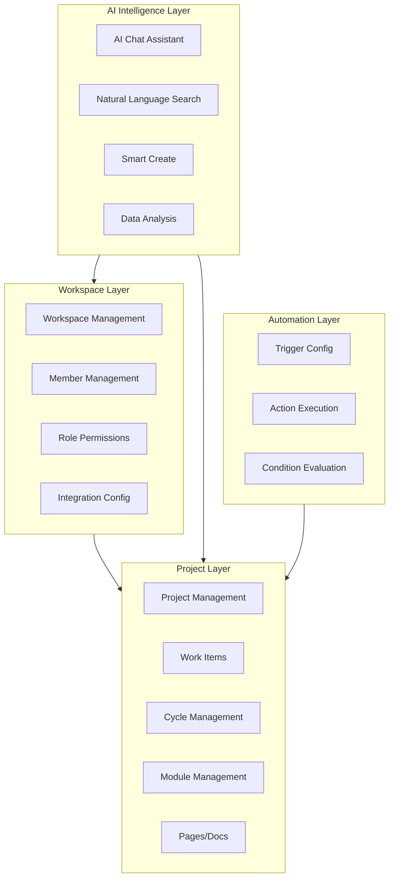

# reqmango Product Requirements Document

> **Last Updated**: 2026-07-13

---

## 1. Product Overview

reqmango is a modern project management platform designed to help teams efficiently plan, track, and deliver work. The platform provides flexible workspace management, intuitive kanban views, powerful automation capabilities, AI assistant, Git integration, and quick create functionality, enabling teams to manage the entire workflow from project planning to delivery in a unified platform.

### 1.1 Core Values

- **Unified Work Hub**: Integrates projects, work items, documents, and team collaboration in one platform
- **Flexible Customization**: Supports custom work item types, workflow states, and automation rules
- **AI-Powered Efficiency**: Interact with project data through natural language for quick insights
- **Seamless Integration**: Deep integration with GitHub, GitLab, Slack, and other mainstream tools

### 1.2 Target Users

This product is designed for various teams that need collaborative project management, including but not limited to:

- Software development teams
- Product management teams
- Design and creative teams
- Cross-functional project teams

---

## 2. Functional Architecture

### 2.1 Product Function Matrix

### 2.2 Core Functional Modules

| Module | Feature Count | Priority | Description |
|--------|--------------|----------|-------------|
| Workspace Management | 8 | P0 | Base container, includes all other functions |
| Project Management | 10 | P0 | Core work organization unit |
| Work Item Management | 12 | P0 | Task, bug, and requirement carrier |
| Cycle & Module | 6 | P1 | Iteration planning and function grouping |
| Pages/Docs | 8 | P1 | Knowledge management and collaborative writing |
| AI Assistant | 5 | P1 | Natural language interaction |
| Automation Workflow | 4 | P2 | Rule-driven automation |
| Third-party Integration | 6 | P2 | External tool connectivity |

---

## 3. Workspace Management

### 3.1 Overview

Workspaces are the top-level container in reqmango, similar to an organization or company concept. They contain all resources needed for team collaboration, including projects, members, settings, and configurations.

### 3.2 Core Features

| Feature | Description | User Action Path |
|---------|-------------|-----------------|
| Create Workspace | First registration or additional workspace creation | Click workspace name → Create Workspace |
| Workspace Settings | Configure members, integrations, import/export | Workspace name → Settings |
| Member Management | Invite, remove, assign roles | Settings → Members |
| Role Permissions | Admin, Member, Guest three-level permissions | Settings → Role Management |
| Workspace Switch | Quick switch between multiple workspaces | Workspace name → Select |
| Delete Workspace | Permanent deletion (Admin permission required) | Settings → General → Delete Workspace |

### 3.3 Member Roles

| Role | Permission Scope | Use Case |
|------|-----------------|----------|
| Admin | Full control | Team leads, project managers |
| Member | Create and edit resources | Team members, developers |
| Guest | Read-only or limited access | External collaborators, clients |

---

## 4. Project Management

### 4.1 Overview

Projects are the core unit for organizing team work. Each project can contain work items, cycles, modules, pages, and other resources to achieve specific business goals.

### 4.2 Core Features

| Feature | Description | Shortcut |
|---------|-------------|----------|
| Create Project | Create new project with basic configuration | N → P |
| Visibility | Public or Private | Project Settings |
| Project Config | Identifier, timezone, feature toggles | Project Settings |
| Feature Enable | Cycles, Modules, Views, etc. | Project Settings → Features |
| Archive Project | Preserve data but hide from display | Project Settings |
| Restore Project | Restore from archived state | Project List |
| Delete Project | Permanent deletion (confirmation required) | Project Settings |

---

## 5. Work Item Management

### 5.1 Overview

Work items are the most basic task carrier in a project. reqmango supports multiple work item types including Issue, Task, Bug, etc., each customizable with states, priorities, and fields.

### 5.2 Core Features

| Feature | Description |
|---------|-------------|
| Create Work Item | Quickly create tasks, bugs, or features |
| Assign Owner | Specify assignee for work item |
| Set State | Todo, In Progress, Done, etc. |
| Set Priority | Urgent, High, Medium, Low |
| Add Labels | Custom category labels |
| Rich Description | Markdown supported |
| Associate Cycle | Assign to iteration |
| Associate Module | Group by functional module |
| Associate Page | Attach related documents |
| Comment | Discuss under work item |
| Attachments | Upload file attachments |
| Activity Log | View change history |

### 5.3 Custom Fields

Custom fields allow users to add specific attributes for different work item types, enabling more flexible data management.

**Field Types:**
- Text (single line, paragraph, read-only)
- Number (with default values)
- Dropdown (single/multi-select)
- Boolean (True/False)
- Date (date format)
- Member Selector (single/multi-select)
- Release Selector (multi-select)
- URL (external links)

---

## 6. Cycle Management

Cycles are used to organize and manage iterative work. They help teams complete a set of related work items within a fixed timebox, similar to Sprints in Scrum.

### 6.1 Core Features

| Feature | Description |
|---------|-------------|
| Create Cycle | Set name and time range |
| Assign Work Items | Add work items to cycle |
| Track Progress | View cycle completion rate |
| Start/End Cycle | Control cycle active state |
| Burndown Chart | Visual progress tracking |
| Cycle Templates | Reuse cycle configurations |

---

## 7. Module Management

Modules are used to group work items by function or business domain. Unlike cycles (time dimension), modules are functional organization.

### 7.1 Core Features

| Feature | Description |
|---------|-------------|
| Create Module | Define functional module names |
| Add Work Items | Include related work items |
| Module Progress | View overall completion |
| Module Members | Assign owners |
| Module Timeline | Set goals and deadlines |

---

## 8. Pages & Documents

Pages is reqmango's document and knowledge management tool. Teams can use it to write product specs, meeting notes, team guidelines, etc., with real-time collaboration support.

### 8.1 Core Features

| Feature | Description |
|---------|-------------|
| Create Page | New blank page |
| Rich Text Editor | Formatting, lists, tables |
| Markdown Support | Full Markdown syntax |
| AI Assistance | Generate, summarize, translate |
| Mention Work Items | @ reference work items |
| Block Operations | Copy, delete, convert |
| Version History | View and restore history |
| Export | Export to Markdown, PDF |

---

## 9. AI Assistant

reqmango AI is an integrated AI assistant that allows users to interact with project data through natural language for quick information retrieval, content creation, and operation execution.

### 9.1 Core Features

| Feature | Description |
|---------|-------------|
| AI Chat | Ask project questions via conversation |
| Natural Language Search | Search work items in everyday language |
| Smart Create | Describe requirements, AI generates work items |
| Data Analysis | AI analyzes project progress and trends |
| Context Awareness | AI understands current project/page context |

### 9.2 AI Interaction Modes

| Mode | Purpose |
|------|---------|
| Ask Mode | Query information, get answers |
| Build Mode | Create work items, execute operations |

---

## 10. Automation Workflow

reqmango supports flexible automation rules to help teams reduce repetitive operations. When specific conditions are met, predefined actions are automatically executed.

### 10.1 Automation Components

| Component | Description |
|-----------|-------------|
| Trigger | Defines when automation activates |
| Condition | Filters target objects |
| Action | Automated operations to execute |

### 10.2 Common Automation Scenarios

| Scenario | Trigger | Action |
|----------|---------|--------|
| Auto-assign | New work item created | Assign to owner |
| Status Sync | Work item completed | Update related items |
| Notification | Deadline approaching | Send reminder |
| Label Management | Specific condition met | Auto-add label |

---

## 11. Time Tracking

reqmango provides native time tracking functionality for teams to record and manage work hours.

### 11.1 Core Features

| Feature | Description |
|---------|-------------|
| Time Recording | Manual or automatic time logging |
| Time Estimation | Set estimated time for work items |
| Time Reports | View statistics and trends |
| Time Approval | Approval process for time records |

---

## 12. Third-party Integration

reqmango offers rich native integrations to seamlessly connect with tools teams use daily, avoiding switching between multiple platforms.

### 12.1 Supported Integrations

| Integration | Features |
|-------------|----------|
| GitHub | Sync Issues and Pull Requests |
| GitLab | Automated MR tracking |
| Slack | Create work items, sync discussions |
| Sentry | Auto-create work items, sync errors |
| Jira | Data import and migration |
| API/Webhooks | Custom integrations |

---

## 13. Technology Architecture

### 13.1 Tech Stack

| Layer | Technology | Description |
|-------|------------|-------------|
| Frontend Framework | Vue 3 + Composition API | Component-based development, reactive system |
| Build Tool | Vite | Fast development experience |
| CSS | TailwindCSS | Atomic CSS |
| State Management | Pinia | Vue3 recommended state management |
| Type System | TypeScript | Type safety |
| Backend Framework | Go + Gin 1.x | High-performance HTTP framework |
| ORM | GORM 2.x | Go ORM framework |
| Database | PostgreSQL 16+ | Relational database |
| Authentication | JWT (golang-jwt/v5) | Bearer token auth |
| AI Integration | DeepSeek / Anthropic / OpenAI | LLM support (SSE streaming) |
| Query Language | RQL (custom) | Advanced work item search |

---

## 14. Non-functional Requirements

### 14.1 Performance Metrics

| Metric | Target |
|--------|--------|
| Page Load Time | < 2 seconds |
| API Response Time | < 500ms |
| AI Chat Response Time | < 5 seconds |
| Concurrent Users | 1000+ |

### 14.2 Security Requirements

- All data transmission uses HTTPS encryption
- Sensitive data encrypted at rest
- Role-based access control (RBAC)
- Operation audit logs
- SSO/SAML enterprise authentication support

### 14.3 Availability Requirements

- Service availability 99.9%
- Multi-timezone, multi-language support
- Comprehensive error messages and documentation
- Data backup and recovery mechanisms

---

## 🌐 Language

- **English** (this document)
- [中文文档](PRD.md)