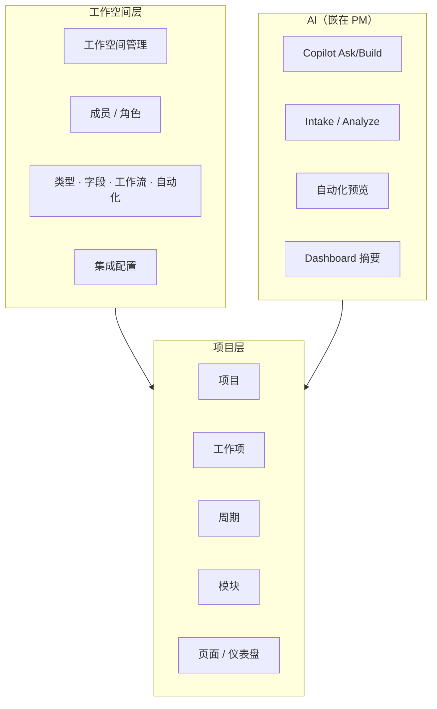
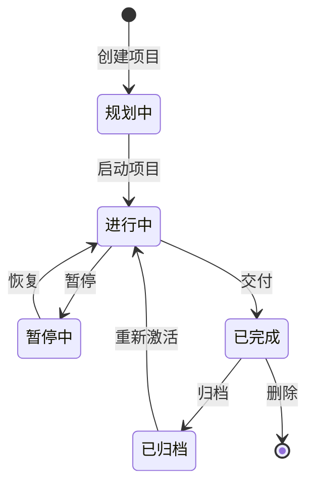
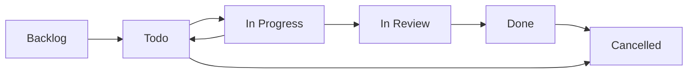
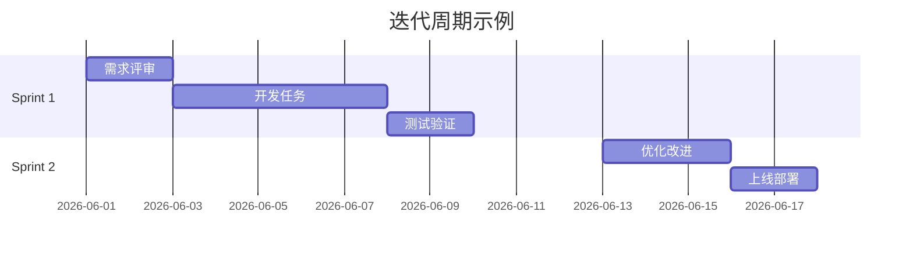
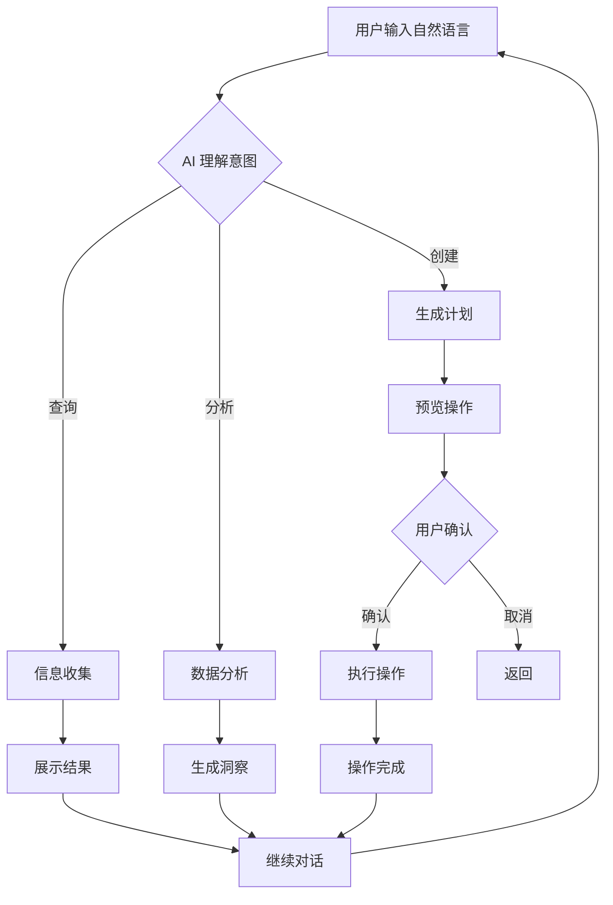
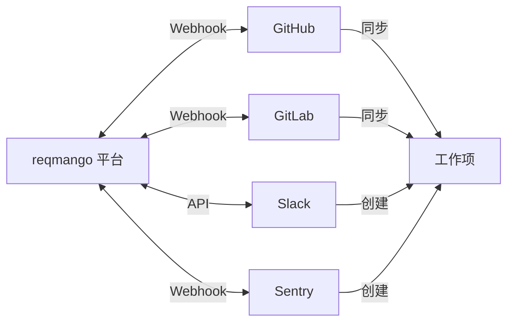
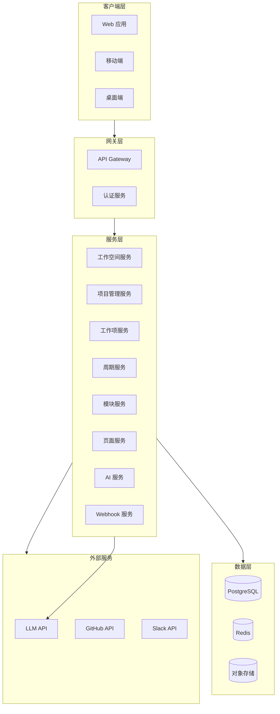
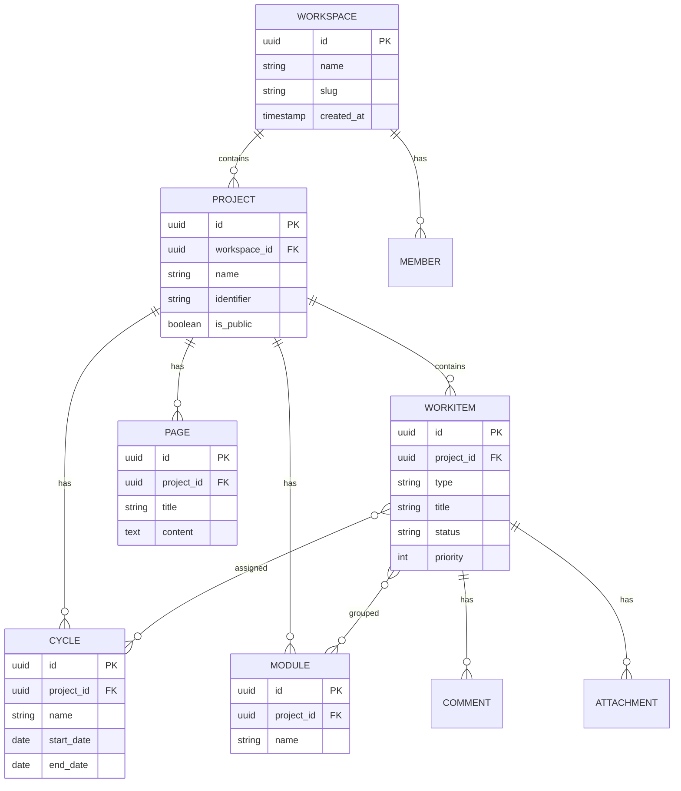

# reqmango 产品需求文档

> **最后更新**: 2026-09-26  
> **状态**: 现行（KB 真相来源）  
> **产品方向**: 原生项目管理 + Plane 路径 AI（Intake / Analyze / 自动化 / 仪表盘摘要）。  
> **非方向**: Harness / Loop / Multica 式 Agent 控制台产品化（已归档，见 [superseded/agent-platform](../superseded/agent-platform/README.md)）。

---

## 1. 产品概述

reqmango 是一款现代化的项目管理平台：工作空间内管理项目、工作项、周期与文档；用**可定制的类型 / 字段 / 工作流 / 自动化**适配团队流程；AI 嵌在 PM 路径上辅助分诊、分析与规则草稿，而不是独立的 Agent 运营台。

### 1.0 产品方向（2026-09）

| 做 | 不做 |
|----|------|
| Issue / Cycle / Module / Pages / Dashboard | 新开 Harness · Loop · 多 Agent 流水线产品化 |
| **自定义工作项类型、自定义字段、自定义工作流、自动化规则**（验收门禁） | 默认暴露 `/agents/*` 控制台（需 `rm_advanced_agents=1`） |
| Intake 分诊、Issue/项目 Analyze、NL→自动化预览、`ai_summary` widget | Multica「Agent as Teammates / 全 SDLC」排期 |

权威设计：[AI PM redesign](../superpowers/specs/2026-09-25-ai-project-management-redesign.md) · 验收：[product-core-qa](../dev/acceptance/2026-09-25-product-core-qa.md)

### 1.1 核心价值

- **统一的工作中心**：项目、工作项、文档和协作在同一平台
- **可配置的流程内核**：类型、字段、状态工作流、自动化规则均为一等能力
- **嵌在工作流里的 AI**：分诊、分析、规则草稿、仪表盘摘要；写入前可预览
- **无缝集成**：GitHub / Slack 等（按实际落地为准）

### 1.2 目标用户

协作交付的软件 / 产品 / 跨职能团队（管理员配置流程，成员推进工作项）。

---

## 2. 功能架构

### 2.1 产品功能矩阵



### 2.2 核心功能模块

| 模块 | 优先级 | 说明 |
|------|--------|------|
| 工作空间 / 项目 / 工作项 | P0 | 主路径 |
| **自定义类型 / 字段 / 工作流 / 自动化** | **P0（门禁）** | 商业化必需；见验收 §H |
| 周期与模块 | P0 | 迭代与功能分组 |
| 页面 / 仪表盘 / 度量 | P1 | 文档与可视 |
| AI（Intake / Analyze / 预览 / 摘要） | P1 | 嵌在 PM，非独立平台 |
| 第三方集成 | P2 | Git / Slack 等 |

---

## 3. 工作空间管理

### 3.1 功能概述

工作空间是 reqmango 的顶层容器，类似于组织或公司的概念。它包含了团队协作所需的所有资源，包括项目、成员、设置和配置。

### 3.2 核心功能点

| 功能 | 描述 | 用户操作路径 |
|------|------|-------------|
| 创建工作空间 | 首次注册或额外创建新工作空间 | 点击工作空间名称 → 创建工作空间 |
| 工作空间设置 | 配置成员、集成、导入导出 | 工作空间名称 → 设置 |
| 成员管理 | 邀请、移除、分配角色 | 设置 → 成员 |
| 角色权限 | Admin、Member、Guest 三级权限 | 设置 → 角色管理 |
| 工作空间切换 | 多工作空间快速切换 | 工作空间名称 → 选择 |
| 删除工作空间 | 永久删除（需 Admin 权限） | 设置 → 通用 → 删除工作空间 |

### 3.3 成员角色说明

| 角色 | 权限范围 | 适用场景 |
|------|---------|---------|
| Admin | 完全控制权 | 团队负责人、项目经理 |
| Member | 创建和编辑资源 | 团队成员、开发者 |
| Guest | 只读或受限访问 | 外部协作者、客户 |

### 3.4 工作空间数据流


---

## 4. 项目管理

### 4.1 功能概述

项目是组织团队工作的核心单元。每个项目可以包含工作项、周期、模块、页面等资源，用于达成特定的业务目标。

### 4.2 核心功能点

| 功能 | 描述 | 快捷键 |
|------|------|--------|
| 创建项目 | 新建项目并配置基本信息 | N → P |
| 设置可见性 | Public（公开）或 Private（私有） | 项目设置 |
| 配置项目 | 标识符、时区、功能开关 | 项目设置 |
| 启用功能 | Cycles、Modules、Views 等 | 项目设置 → 功能 |
| 归档项目 | 保留数据但隐藏显示 | 项目设置 |
| 恢复项目 | 从归档状态恢复 | 项目列表 |
| 删除项目 | 永久删除（需确认） | 项目设置 |

### 4.3 项目配置项

| 配置项 | 说明 | 示例 |
|--------|------|------|
| 项目名称 | 清晰描述项目目的 | 用户认证系统 |
| 项目标识符 | 唯一代码，附加到所有工作项 | UA-123 |
| 可见性 | 控制谁可以访问 | Public / Private |
| 时区 | 用于时间计算 | Asia/Shanghai |
| 功能开关 | 启用/禁用 Cycles、Modules 等 | 启用 Cycles |

### 4.4 项目生命周期



---

## 5. 工作项管理

### 5.1 功能概述

工作项是项目中最基本的任务载体。reqmango 支持多种工作项类型，包括 Issue（问题）、Task（任务）、Bug（缺陷）等，每种类型都可以自定义状态、优先级和字段。

### 5.2 核心功能点

| 功能 | 描述 |
|------|------|
| 创建工作项 | 快速创建任务、缺陷或功能 |
| 分配负责人 | 指定工作项的处理人 |
| 设置状态 | 从待办、进行中到已完成 |
| 设置优先级 | Urgent、High、Medium、Low |
| 添加标签 | 自定义分类标签 |
| 描述详情 | 富文本描述，支持 Markdown |
| 关联 Cycle | 将工作项分配到迭代 |
| 关联 Module | 按功能模块分组 |
| 关联页面 | 附加相关文档 |
| 评论协作 | 在工作项下讨论 |
| 附件上传 | 添加文件附件 |
| 活动日志 | 查看变更历史 |

### 5.3 工作项状态流



### 5.4 工作项类型定义

| 类型 | 用途 | 典型场景 |
|------|------|---------|
| Issue | 通用问题或任务 | 需求、功能点 |
| Task | 具体执行任务 | 代码实现、文档撰写 |
| Bug | 缺陷报告 | 错误修复 |
| Story | 用户故事 | 敏捷开发 |
| Epic | 大型功能集 | 长期规划 |

### 5.5 自定义字段（Custom Properties）

自定义字段允许用户为不同的工作项类型添加特定的属性，实现更灵活的数据管理。

#### 5.5.1 字段类型

| 字段类型 | 属性 | 说明 |
|----------|------|------|
| **文本** | 单行、段落、只读 | 用于短文本或长描述 |
| **数字** | 默认值 | 用于计数、估算等数值 |
| **下拉** | 单选、多选 | 预定义选项列表 |
| **布尔** | True/False | 用于开关类属性 |
| **日期** | 日期格式 | 用于日期选择 |
| **成员选择器** | 单选、多选 | 关联项目成员 |
| **发布选择器** | 多选 | 关联发布版本 |
| **URL** | 链接 | 用于外部资源链接 |

#### 5.5.2 核心功能点

| 功能 | 描述 |
|------|------|
| 创建自定义字段 | 为工作项类型添加自定义属性 |
| 设置字段属性 | 必填、可选、只读 |
| 设置默认值 | 为数字、下拉等字段设置默认值 |
| 管理下拉选项 | 添加、编辑、删除下拉选项 |
| 字段值更新 | 在工作项中更新自定义字段值 |
| 活动追踪 | 记录自定义字段的变更历史 |

#### 5.5.3 自定义字段示例

**Bug 类型自定义字段：**
- 受影响版本 (下拉)
- 解决版本 (下拉)
- 环境 (下拉: 开发、测试、生产)
- 复现步骤 (段落文本)
- 审批状态 (下拉)

**产品发布类型字段：**
- 发布日期 (日期)
- 目标市场 (下拉，多选)
- 预算 (数字)
- 审批状态 (下拉)
- 负责人 (成员选择器)

#### 5.5.4 字段验证规则

- 必填字段在工作项创建时必须填写
- 只读字段不可编辑
- 数字字段可设置有效范围
- 下拉字段可设置是否允许多选

---

## 6. 周期管理

### 6.1 功能概述

周期（Cycle）是用于组织和管理迭代工作的功能。它帮助团队在固定的时间盒内完成一组相关的工作项，类似于 Scrum 中的 Sprint。

### 6.2 核心功能点

| 功能 | 描述 |
|------|------|
| 创建周期 | 设置名称、时间范围 |
| 分配工作项 | 将工作项纳入周期 |
| 跟踪进度 | 查看周期完成率 |
| 开始/结束周期 | 控制周期的活跃状态 |
| 周期报告 | 燃尽图、统计视图 |
| 周期模板 | 复用周期配置 |

### 6.3 周期视图



---

## 7. 模块管理

### 7.1 功能概述

模块用于按功能或业务领域对工作项进行分组。与周期的时间维度不同，模块是功能维度的组织方式。

### 7.2 核心功能点

| 功能 | 描述 |
|------|------|
| 创建模块 | 定义功能模块名称 |
| 添加工作项 | 将相关工作项纳入模块 |
| 模块进度 | 查看模块整体完成度 |
| 模块成员 | 指定负责人 |
| 模块时间线 | 设置目标和截止日期 |

---

## 8. 页面与文档

### 8.1 功能概述

页面（Pages）是 reqmango 的文档和知识管理工具。团队可以用它来撰写产品规格、会议记录、团队规范等，并支持实时协作。

### 8.2 核心功能点

| 功能 | 描述 |
|------|------|
| 创建页面 | 新建空白页面 |
| 富文本编辑 | 格式化文本、列表、表格 |
| Markdown 支持 | 完整的 Markdown 语法 |
| AI 辅助 | AI 帮助生成内容、总结、翻译 |
| 提及工作项 | 在文档中 @ 提及工作项 |
| 块操作 | 复制链接、复制、删除块 |
| 转换工作项 | 将文本快速转为工作项 |
| 全宽模式 | 扩展编辑区域 |
| 页面锁定 | 防止意外编辑 |
| 版本历史 | 查看和恢复历史版本 |
| 导出功能 | 导出为 Markdown、PDF |
| 移动页面 | 调整页面层级结构 |

### 8.3 页面编辑器功能

```mermaid
flowchart TB
    A[页面编辑器] --> B[文本格式]
    A --> C[AI 助手]
    A --> D[提及引用]
    A --> E[块操作]
    
    B --> B1[标题/列表/表格]
    C --> C1[生成内容]
    C --> C2[总结要点]
    C --> C3[翻译语言]
    D --> D1[@工作项]
    D --> D2[链接跳转]
    E --> E1[复制/删除]
    E --> E2[转工作项]
```

---

## 9. AI 智能助手

### 9.1 功能概述

reqmango AI 是集成在平台中的 AI 助手，允许用户通过自然语言与项目数据交互，快速获取信息、创建内容、执行操作。

### 9.2 核心功能点

| 功能 | 描述 |
|------|------|
| AI 聊天 | 通过对话询问项目问题（Ask 只读 / Build 可写） |
| 自然语言搜索 | 用日常语言搜索工作项 |
| 智能创建 | 描述需求，AI 生成工作项 |
| 数据分析 | Issue 或项目级 Analyze：摘要、洞察、瓶颈 |
| 项目总结存 Page | 项目页一键 AI 总结，可另存为项目 Page |
| Dashboard AI 摘要 | 仪表盘 `ai_summary` widget，打开加载、可刷新 |
| 上下文感知 | AI 理解当前项目、Issue、页面上下文 |
| 开箱 PM Agent | ensure-pm；Issue 指派 / 评论 @Agent / 活动审计 |

### 9.3 AI 对话模式

| 模式 | 用途 |
|------|------|
| Ask 模式 | 查询信息、获取答案 |
| Build 模式 | 创建工作项、执行操作 |

### 9.4 AI 操作流程



---

## 14. 自动化工作流

### 14.1 功能概述

reqmango 支持灵活的自动化规则，帮助团队减少重复性操作。当满足特定条件时，自动执行预定义的动作。

### 14.2 自动化组件

| 组件 | 说明 |
|------|------|
| 触发器 | 定义何时触发自动化 |
| 条件 | 筛选目标对象 |
| 动作 | 执行的自动化操作 |

### 14.3 常见自动化场景

| 场景 | 触发 | 动作 |
|------|------|------|
| 自动分配 | 新建工作项 | 分配给负责人 |
| 状态同步 | 工作项完成 | 更新相关工作项 |
| 通知提醒 | 截止日期临近 | 发送提醒 |
| 标签管理 | 指定条件 | 自动添加标签 |
| AI 分诊/风险/Spec 模板 | `issue.created` 等 | `dispatch_agent` 等（设置页一键模板） |
| 自然语言配规则 | 用户描述意图 | `automation-preview` 生成草稿 → RuleBuilder 确认后保存 |

---

## 15. 时间跟踪

### 15.1 功能概述

reqmango 提供原生的时间跟踪功能，让团队记录和管理工作时间。

### 15.2 核心功能点

| 功能 | 描述 |
|------|------|
| **时间记录** | 手动或自动记录工作时间 |
| **时间估算** | 设置工作项预估时间 |
| **时间报告** | 查看时间统计和趋势 |
| **时间审批** | 时间记录审批流程 |

---

## 16. 自定义仪表板

### 16.1 功能概述

自定义仪表板让团队创建个性化的数据视图，实时监控项目进度和团队绩效。

### 16.2 核心功能点

| 功能 | 描述 |
|------|------|
| **仪表板创建** | 自定义仪表板布局 |
| **图表组件** | 多种图表类型（柱状图、饼图、折线图） |
| **数据筛选** | 按项目、周期、成员筛选 |
| **实时更新** | 数据实时同步更新 |
| **工作空间分析** | 整体工作空间数据分析 |

---

## 17. Command K 导航

### 17.1 功能概述

Command K 是 reqmango 的键盘优先快速操作界面，让用户通过快捷键快速导航和执行操作。

### 17.2 核心功能点

| 功能 | 描述 |
|------|------|
| **快速搜索** | 搜索工作项、项目、页面 |
| **快速导航** | 快速跳转到任意页面 |
| **快速操作** | 创建、更新、删除工作项 |
| **快捷键支持** | 全键盘操作支持 |

---

## 18. 第三方集成

### 18.1 功能概述

reqmango 提供了丰富的原生集成，可以与团队日常使用的工具无缝连接，避免在多个平台间切换。

### 18.2 支持的集成

| 集成 | 功能 |
|------|------|
| GitHub | 同步 Issue 和 Pull Request |
| GitHub Enterprise | 企业版 GitHub 集成 |
| GitLab | 自动化 MR 跟踪 |
| Slack | 创建工作项、同步讨论 |
| Sentry | 自动创建工作项、同步错误 |
| Draw.io | 在页面中嵌入图表 |
| Jira | 数据导入和迁移 |
| API/Webhooks | 自定义集成 |

### 18.3 集成架构



---

## 19. 审计与合规

### 19.1 功能概述

reqmango 提供完整的审计日志和合规记录功能，满足企业合规性要求。

### 19.2 核心功能点

| 功能 | 描述 |
|------|------|
| **审计日志** | 记录所有操作历史 |
| **合规记录** | 合规性检查记录 |
| **数据导出** | 导出审计数据 |
| **访问控制** | 基于角色的审计数据访问 |

---

## 20. 企业认证

### 20.1 功能概述

reqmango 支持多种企业级认证方式，满足组织的安全和合规要求。

### 20.2 支持的认证方式

| 认证方式 | 描述 |
|---------|------|
| **SSO** | 单点登录支持 |
| **SAML** | SAML 2.0 认证 |
| **OIDC** | OpenID Connect 认证 |
| **LDAP** | LDAP/Active Directory 集成 |

---

## 21. 用户界面设计

### 21.1 设计原则

- **清晰直观**：重要信息一目了然
- **高效操作**：减少点击次数，快捷键支持
- **一致性**：统一的视觉语言和交互模式
- **响应式**：适配桌面、平板、移动设备

### 21.2 配色方案

| 用途 | 色值 | 说明 |
|------|------|------|
| 主色调 | #6366F1 | Indigo，用于主要按钮和强调 |
| 辅助色 | #8B5CF6 | 紫色，用于 AI 相关功能 |
| 成功色 | #10B981 | 绿色，表示完成状态 |
| 警告色 | #F59E0B | 橙色，表示待处理 |
| 错误色 | #EF4444 | 红色，表示错误或紧急 |
| 背景色 | #FFFFFF / #F9FAFB | 白色/浅灰 |
| 文字色 | #111827 / #6B7280 | 深灰/中灰 |

### 21.3 布局结构

| 区域 | 内容 |
|------|------|
| 侧边栏 | 工作空间、项目、周期、模块、页面导航 |
| 顶部栏 | 搜索、AI 助手、通知、用户菜单 |
| 主内容区 | 工作项列表、看板、详情页面 |
| 右面板 | 工作项详情、评论区（可收起） |

---

## 22. 技术架构

### 22.1 系统架构



### 22.2 技术栈选型

本项目采用 **Vue3 + Go + Gin + GORM** 技术栈。

| 层级 | 技术 | 说明 |
|------|------|------|
| 前端框架 | Vue 3 + Composition API | 组件化开发，响应式系统 |
| 构建工具 | Vite | 快速开发体验 |
| 样式方案 | TailwindCSS | 原子化 CSS |
| 状态管理 | Pinia | Vue3 官方推荐状态管理 |
| 前端类型 | TypeScript | 类型安全 |
| 后端框架 | Go + Gin 1.x | 高性能 HTTP 框架 |
| 数据验证 | Gin ShouldBindJSON | 请求绑定与验证 |
| 数据库 ORM | GORM 2.x | Go ORM 框架 |
| 数据库 | PostgreSQL 16+ | 关系型数据 |
| 认证 | JWT (golang-jwt/v5) | Bearer token 认证 |
| 文件存储 | 本地文件系统 | 附件上传 |
| AI 集成 | DeepSeek / Anthropic / OpenAI | LLM 支持 (SSE 流式) |
| 查询语言 | RQL (自定义) | 工作项高级搜索 |

### 22.3 数据库模型 (核心实体)



---

## 23. 非功能需求

### 23.1 性能指标

| 指标 | 目标值 |
|------|--------|
| 页面加载时间 | < 2 秒 |
| API 响应时间 | < 500ms |
| AI 对话响应时间 | < 5 秒 |
| 并发用户数 | 支持 1000+ |

### 23.2 安全需求

- 所有数据传输使用 HTTPS 加密
- 敏感数据静态加密存储
- 基于角色的访问控制（RBAC）
- 操作审计日志
- 支持 SSO/SAML 企业认证

### 23.3 可用性需求

- 服务可用性 99.9%
- 支持多时区、多语言
- 完善的错误提示和帮助文档
- 数据备份和恢复机制

---

## 24. 实施与状态（摘要）

主路径与 AI PM（P1–2 + B1–C2）及原生 PM 验收（含核心定制门禁）**已完成**。  
详细阶段表与 Schema 清单为历史规划，不再作为排期依据；以代码与验收文档为准。

| 里程碑 | 状态 | 文档 |
|--------|------|------|
| 原生 PM 主路径 | ✅ PASS | [product-core-qa](../dev/acceptance/2026-09-25-product-core-qa.md) |
| AI PM Plane 路径 | ✅ PASS | [redesign](../superpowers/specs/2026-09-25-ai-project-management-redesign.md) |
| Agent 平台产品化 | ❌ 废止 | [superseded/agent-platform](../superseded/agent-platform/README.md) |
| 下一阶段 | 存量质量 | 不新开 AI 大功能 |

---

**文档版本**：v5.0（产品方向刷新 + 核心定制门禁）  
**创建日期**：2026-06-13 · **刷新**：2026-09-26  
**所属项目**：reqmango

