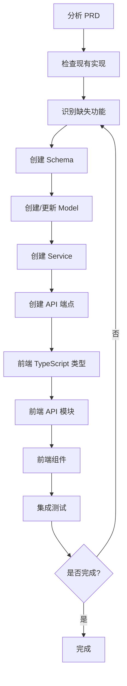

# Plane AI - SDD 规格文档

---

## 1. 当前实现状态

### 1.1 后端实现状态

| 模块 | 模型 | Schema | 服务 | API端点 | 状态 |
|------|------|--------|------|---------|------|
| 用户认证 (auth) | ✅ user.py | ✅ user.py | ❌ | ✅ auth.py | ⚠️ 部分完成 |
| 工作空间 (workspace) | ✅ workspace.py | ✅ workspace.py | ❌ | ✅ workspace.py | ⚠️ 部分完成 |
| 项目管理 (project) | ✅ project.py | ✅ project.py | ❌ | ✅ project.py | ⚠️ 部分完成 |
| 工作项 (issue) | ✅ issue.py | ✅ issue.py | ✅ services/issue.py | ✅ endpoints/issue.py | ✅ 完成 |
| 工作项类型 (issue_type) | ✅ issue_type.py | ✅ issue_type.py | ✅ project_settings.py | ✅ project_settings.py | ✅ 完成 |
| 状态管理 (state) | ✅ state.py | ✅ issue_type.py | ✅ project_settings.py | ✅ project_settings.py | ✅ 完成 |
| 标签 (label) | ✅ label.py | ✅ issue_type.py | ✅ project_settings.py | ✅ project_settings.py | ✅ 完成 |
| 周期管理 (cycle) | ✅ cycle.py | ✅ cycle.py | ❌ | ❌ | ⚠️ 模型+Schema |
| 模块管理 (module) | ✅ module.py | ✅ module.py | ✅ services/module.py | ✅ endpoints/module.py | ✅ 完成 |
| 估算点 (estimate_point) | ✅ estimate_point.py | ❌ | ❌ | ❌ | ⚠️ 仅模型 |
| 自定义字段 (custom_field) | ✅ custom_field.py | ✅ custom_field.py | ✅ services/custom_field.py | ✅ endpoints/custom_field.py | ✅ 完成 |
| 工作流 (workflow) | ✅ workflow.py | ✅ workflow.py | ✅ services/workflow.py | ✅ endpoints/workflow.py | ✅ 完成 |
| 自动化 (automation) | ✅ workflow.py | ✅ workflow.py | ✅ services/workflow.py | ✅ endpoints/workflow.py | ✅ 完成 |
| AI 功能 (ai) | ✅ ai_thread.py | ✅ ai.py | ✅ services/ai.py | ✅ endpoints/ai.py | ⚠️ 框架代码 |
| 页面文档 (page) | ❌ | ✅ page.py | ❌ | ❌ | ⚠️ 仅Schema |

### 1.2 前端实现状态

| 模块 | 类型定义 | API模块 | 组件 | 视图 | 状态 |
|------|----------|---------|------|------|------|
| 用户认证 (auth) | ✅ types/index.ts | ✅ api/auth.ts | ❌ | ✅ Login.vue, Register.vue | ⚠️ 部分完成 |
| 工作空间 (workspace) | ✅ types/index.ts | ✅ api/workspace.ts | ❌ | ✅ Workspace.vue | ⚠️ 部分完成 |
| 项目管理 (project) | ✅ types/index.ts | ❌ | ❌ | ✅ Project.vue | ⚠️ 部分完成 |
| 工作项 (issue) | ✅ types/issue.ts | ✅ api/issue.ts | ⚠️ IssueDetail.vue | ✅ 类型+API完成 |
| 工作项类型 (issue_type) | ✅ project-settings.ts | ✅ project-settings.ts | ❌ | ❌ | ⚠️ 类型+API完成 |
| 状态管理 (state) | ✅ project-settings.ts | ✅ project-settings.ts | ❌ | ❌ | ⚠️ 类型+API完成 |
| 标签 (label) | ✅ project-settings.ts | ✅ project-settings.ts | ❌ | ❌ | ⚠️ 类型+API完成 |
| 自定义字段 (custom_field) | ✅ types/custom-field.ts | ✅ api/custom-field.ts | ✅ CustomFieldValueInput.vue, CustomFieldManager.vue | ✅ CustomFields.vue | ✅ 完成 |
| 工作流 (workflow) | ✅ types/workflow.ts | ✅ api/workflow.ts | ❌ | ❌ | ⚠️ 类型+API完成 |
| 自动化 (automation) | ✅ types/workflow.ts | ✅ api/workflow.ts | ❌ | ❌ | ⚠️ 类型+API完成 |
| AI 功能 (ai) | ❌ | ❌ | ❌ | ❌ | ❌ 未实现 |

---

## 2. 待实现功能清单（按 SDD 流程）

### 2.1 Phase 1: Schema + Model（数据层） - ✅ 已完成

| 功能 | Schema | Model | 状态 |
|------|--------|-------|------|
| IssueType Schema | ✅ issue_type.py | ✅ 已存在 | ✅ 完成 |
| State Schema | ✅ issue_type.py | ✅ 已存在 | ✅ 完成 |
| Label Schema | ✅ issue_type.py | ✅ 已存在 | ✅ 完成 |
| Workflow Schema | ✅ workflow.py | ✅ workflow.py | ✅ 完成 |
| Automation Schema | ✅ workflow.py | ✅ workflow.py | ✅ 完成 |
| Issue Schema 完善 | ✅ 已存在 | ✅ 已存在 | ⚠️ 需补充自定义字段关联 |
| EstimatePoint Schema | ❌ 待创建 | ✅ 已存在 | P2 |
| Page Model | ❌ 待创建 | ❌ 待创建 | P2 |

### 2.2 Phase 2: Service + API（服务层）

| 功能 | Service | API端点 | 状态 |
|------|---------|---------|------|
| IssueType CRUD | ✅ project_settings.py | ✅ project_settings.py | ✅ 完成 |
| State CRUD | ✅ project_settings.py | ✅ project_settings.py | ✅ 完成 |
| Label CRUD | ✅ project_settings.py | ✅ project_settings.py | ✅ 完成 |
| Workflow CRUD | ✅ workflow.py | ✅ workflow.py | ✅ 完成 |
| Automation CRUD | ✅ workflow.py | ✅ workflow.py | ✅ 完成 |
| 工作项关联管理 | ✅ issue.py | ✅ issue.py | ✅ 完成 |
| Cycle CRUD | ✅ cycle.py | ✅ cycle.py | ✅ 完成 |
| Module CRUD | ✅ module.py | ✅ module.py | ✅ 完成 |
| Project 完善 | ✅ project.py | ✅ project.py | ✅ 完成 |

### 2.3 Phase 3: 前端集成

| 功能 | TypeScript类型 | API模块 | 组件 | 状态 |
|------|----------------|---------|------|--------|
| IssueType | ✅ project-settings.ts | ✅ project-settings.ts | ❌ 待创建 | ⚠️ 类型+API完成 |
| State | ✅ project-settings.ts | ✅ project-settings.ts | ❌ 待创建 | ⚠️ 类型+API完成 |
| Label | ✅ project-settings.ts | ✅ project-settings.ts | ❌ 待创建 | ⚠️ 类型+API完成 |
| Workflow | ✅ workflow.ts | ✅ workflow.ts | ❌ 待创建 | ⚠️ 类型+API完成 |
| Automation | ✅ workflow.ts | ✅ workflow.ts | ❌ 待创建 | ⚠️ 类型+API完成 |
| Issue | ✅ issue.ts | ✅ issue.ts | ⚠️ IssueDetail.vue | ✅ 类型+API完成 |
| Cycle | ❌ 待创建 | ❌ 待创建 | ❌ 待创建 | P1 |
| Module | ❌ 待创建 | ❌ 待创建 | ❌ 待创建 | P1 |

---

## 3. 需要讨论的问题

### 3.1 工作项类型 (IssueType)

**问题 1**: IssueType 是否需要关联自定义字段？
- Plane 中，每种工作项类型可以有不同的自定义字段集合
- 例如：Bug 类型有"受影响版本"字段，Story 类型有"用户价值"字段

**问题 2**: IssueType 的默认类型如何处理？
- PRD 定义了 5 种类型：Issue, Task, Bug, Story, Epic
- 是否需要在创建项目时自动创建这些默认类型？

**问题 3**: IssueType 是否支持自定义图标？
- 当前模型只有 `icon` 字段（字符串），但没有定义图标库

### 3.2 状态管理 (State)

**问题 4**: State 的分组 (group) 如何使用？
- 当前模型定义了 group 字段：backlog, todo, in_progress, done, cancelled
- 是否需要支持自定义分组？还是固定这 5 个分组？

**问题 5**: 状态转换规则是否需要定义？
- PRD 中定义了状态流：Backlog → Todo → In Progress → In Review → Done
- 是否需要定义哪些状态可以转换到哪些状态？

### 3.3 工作项 (Issue)

**问题 6**: Issue 的优先级是否需要自定义？
- 当前使用固定枚举：urgent, high, medium, low, none
- Plane 支持自定义优先级，是否需要实现？

**问题 7**: Issue 的父子关系如何处理？
- 当前模型有 `parent_id` 字段支持子任务
- Epic → Story → Task 的层级关系是否需要特殊处理？

### 3.4 AI 功能

**问题 8**: AI 服务需要集成哪个 LLM？
- 当前是框架代码，需要集成实际的 LLM API
- 选项：OpenAI、Claude、本地部署的模型？

**问题 9**: AI 的上下文范围如何定义？
- AI 需要访问哪些数据？工作空间级别还是项目级别？
- 是否需要考虑数据权限？

---

## 4. 下一步行动

### 4.1 等待用户确认的问题

请用户回答上述 9 个问题，以便继续 SDD 流程。

### 4.2 确认后的实施顺序

1. **Phase 1**: 创建缺失的 Schema（IssueType, State, Label）
2. **Phase 2**: 创建 Service 和 API 端点
3. **Phase 3**: 前端类型定义和组件开发
4. **Phase 4**: 测试验证

---

## 5. SDD 文档目录

### 5.1 Issue（工作项）模块

| 文档类型 | 文件路径 | 状态 |
|----------|----------|------|
| Design | [docs/sdd/issue/design.md](file:///d:/code/reqmango/docs/sdd/issue/design.md) | ✅ 完成 |
| Plan | [docs/sdd/issue/plan.md](file:///d:/code/reqmango/docs/sdd/issue/plan.md) | ✅ 完成 |
| Task | [docs/sdd/issue/task.md](file:///d:/code/reqmango/docs/sdd/issue/task.md) | ✅ 完成 |

### 5.2 Cycle（周期）模块

| 文档类型 | 文件路径 | 状态 |
|----------|----------|------|
| Design | [docs/sdd/cycle/design.md](file:///d:/code/reqmango/docs/sdd/cycle/design.md) | 🔄 待开发 |
| Plan | [docs/sdd/cycle/plan.md](file:///d:/code/reqmango/docs/sdd/cycle/plan.md) | 🔄 待开发 |
| Task | [docs/sdd/cycle/task.md](file:///d:/code/reqmango/docs/sdd/cycle/task.md) | 🔄 待开发 |

### 5.3 Module（模块）模块

| 文档类型 | 文件路径 | 状态 |
|----------|----------|------|
| Design | [docs/sdd/module/design.md](file:///d:/code/reqmango/docs/sdd/module/design.md) | 🔄 待开发 |
| Plan | [docs/sdd/module/plan.md](file:///d:/code/reqmango/docs/sdd/module/plan.md) | 🔄 待开发 |
| Task | [docs/sdd/module/task.md](file:///d:/code/reqmango/docs/sdd/module/task.md) | 🔄 待开发 |

---

## 6. SDD 流程图

---

**文档版本**: v1.0  
**创建日期**: 2026-06-14  
**基于**: PRD.md v4.0